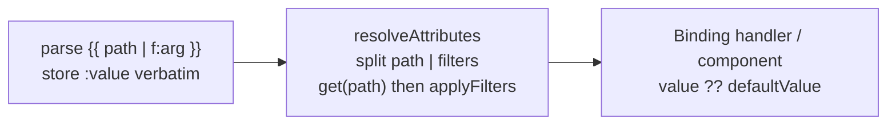

# Add Chained Pipe Filters to `@comark/binding`

## Key insight: one resolution chokepoint

Every binding — text `{{ }}` and attribute `:prop="..."` — resolves its dot-path through **one** function, `resolveAttributes` in [packages/comark/src/internal/stringify/attributes.ts](packages/comark/src/internal/stringify/attributes.ts). The binding text node's `:value` is resolved in [state.ts `one()`](packages/comark/src/internal/stringify/state.ts) (lines 62-68) into `props.value`, which the renderer `Binding` handlers/components then display. So applying filters *inside* `resolveAttributes` covers text bindings, attribute bindings, string renderers, and all four framework renderers with a single evaluation path.

## Configuration decision (confirmed)

`filters` is a **render-time** option (functions cannot live in the serializable AST). It is added to `RendererOptions` and threaded onto `state.context.filters`; framework renderers accept a `filters` prop. Scope: **both** text and attribute/component bindings.

## 1. Shared filter engine (core)

New file `packages/comark/src/utils/filters.ts`, re-exported from [packages/comark/src/utils/index.ts](packages/comark/src/utils/index.ts):

- Types: `BindingFilter = (value: unknown, ...args: unknown[]) => unknown`, `BindingFilters = Record<string, BindingFilter>`, `FilterSpec = { name: string; args: unknown[] }`.
- `parseBindingExpression(expr: string): { path: string; filters: FilterSpec[] }` — a quote-aware, char-scanning tokenizer (no regex, per perf rules):
  - Fast path: if no `|` present, return `{ path: expr.trim(), filters: [] }`.
  - Split on single `|` (a `||` pair is never a split — it cannot appear in a resolved `:value` because the parser strips the default first, but guard anyway).
  - Each segment after the first is `name:arg1:arg2`; colons **inside quotes** do not split (supports `date:'YYYY-MM-DD HH:mm'`).
  - Args parsed as literals: quoted → string; else `JSON.parse` (number/boolean/null); else bare string.
- `applyBindingFilters(value, filters, registry): unknown` — fold each spec: look up `registry[name]`; throw `Unknown binding filter: "<name>"` if missing (fail-fast, mirrors `resolveIfWrapper`); call `fn(value, ...args)`.

## 2. Thread filters through resolution

- [packages/comark/src/types.ts](packages/comark/src/types.ts): add `filters?: BindingFilters` to `RendererOptions` (line 224) and document it on `NodeRenderData`/context flow. `createState` already spreads options into `context` (state.ts line 116-125), so `state.context.filters` is populated automatically for all string renderers.
- [attributes.ts](packages/comark/src/internal/stringify/attributes.ts): add `filters?: BindingFilters` to `ResolveAttributesOptions`. In both binding branches (`parseJson` mode line 61-75 and default mode line 76-83), replace the bare `get(renderData, value)` with: `const { path, filters } = parseBindingExpression(value); let out = get(renderData, path); if (filters.length) out = applyBindingFilters(out, filters, options.filters ?? {})`. Keep the existing `undefined` fallback and the href/src unsafe-URL check (line 92-100) operating on the **final** filtered value.
- [state.ts `one()`](packages/comark/src/internal/stringify/state.ts) line 64: pass `{ filters: state.context.filters as BindingFilters }` into the `resolveAttributes` call.
- Update the other `resolveAttributes` callers to forward the registry:
  - [packages/comark/src/plugins/components.ts](packages/comark/src/plugins/components.ts) (block components in string render).
  - `resolveAttribute` helper (attributes.ts line 112) — extend for `:prop` reads used by `::if`/`::for` props.

## 3. Binding plugin surface

[packages/comark/src/plugins/binding.ts](packages/comark/src/plugins/binding.ts):
- Parser (lines 105-142) needs **no structural change** — everything before `||` (including ` | filter` pipeline) is already stored verbatim in `:value`; keep the empty-value guard. Optionally validate the base path segment is non-empty.
- Re-export `BindingFilter`, `BindingFilters`, `FilterSpec`, `parseBindingExpression`, `applyBindingFilters` for public API.
- `Binding` round-trip handler (lines 159-167): unchanged — `:value` already carries the pipeline, so `{{ path | upper }}` round-trips. Add a test asserting this.

## 4. Framework renderers (thread `filters` prop)

Framework renderers call `resolveAttributes(..., { parseJson: true })` directly and do not use `createState`, so each must accept a `filters` prop and forward it. The `Binding`/`If` components need no change (value already resolved upstream).

- React: [MarkdownDocument.tsx](packages/comark-react/src/components/MarkdownDocument.tsx) line 143 + `Markdown.tsx`, `MarkdownClient.tsx`, `MarkdownLive.tsx`.
- Vue: [MarkdownDocument.ts](packages/comark-vue/src/components/MarkdownDocument.ts) + `Markdown.ts`.
- Svelte: [MarkdownNode.svelte](packages/comark-svelte/src/components/MarkdownNode.svelte) + `MarkdownDocument.svelte`, `Markdown.svelte`.
- Angular: [markdown-node.component.ts](packages/comark-angular/src/components/markdown-node.component.ts) + `markdown-parsed.component.ts`, `markdown.component.ts`.
- HTML/ANSI need no renderer change (they flow through `render()`/`createState`); confirm `createHtmlRenderer`/`createAnsiRenderer` pass `filters` (already flows via `ParserOptions & RendererOptions`).

## 5. Grammar polish (optional, non-blocking)

The existing `#binding` rules already tolerate single `|` inside the variable capture, so filters highlight (as part of the variable). Optionally add a dedicated filter capture in [shiki/language-comark.ts](packages/comark/src/plugins/shiki/language-comark.ts) (lines 75-96) and the parallel [rangi/language-comark.ts](packages/comark/src/plugins/rangi/language-comark.ts).

## 6. Tests

- New `packages/comark/test/filters.test.ts` — unit tests for `parseBindingExpression` (chains, colon args, quoted args with inner colons, no-filter fast path, `||` guard) and `applyBindingFilters` (sequential fold, unknown-filter throw).
- [resolve-attributes.test.ts](packages/comark/test/resolve-attributes.test.ts) — filter application in both `parseJson` and default modes, for a `:value` text binding and a `:prop` attribute binding, with a registry.
- [binding.test.ts](packages/comark/test/plugins/binding.test.ts) — parse + round-trip of `{{ a | upper | truncate:10 }}`.
- Per-renderer: `plugin-binding.test.ts` in comark-html, comark-ansi, and the React/Vue/Svelte/Angular equivalents + `renderer-data-binding` tests — assert `<UserCard :name="user.name | upper"/>` and `{{ title | upper }}` render filtered output when `filters` is supplied.
- Note: SPEC fixtures (input→output only) cannot register JS filter functions, so coverage stays in vitest.

## 7. Docs

- [docs/content/4.plugins/1.built-in/binding.md](docs/content/4.plugins/1.built-in/binding.md): new "Pipe filters" section — syntax, `filters` render option, chaining, args, `||` default composition (`{{ a | f || fallback }}`), attribute-binding usage, unknown-filter behavior.
- Update `AGENTS.md` Package Exports Reference to list the new `BindingFilter`/`BindingFilters` exports and the `filters` renderer option.

## Notes / decisions baked in
- Unknown filter → throw (fail-fast). Filters own their null-safety (`val?.toUpperCase()`), matching the issue examples.
- Filter args are literals only (no context references) in v1.
- Structural generators (`{{ data | table }}`) remain out of scope, delegated to components per the issue.
