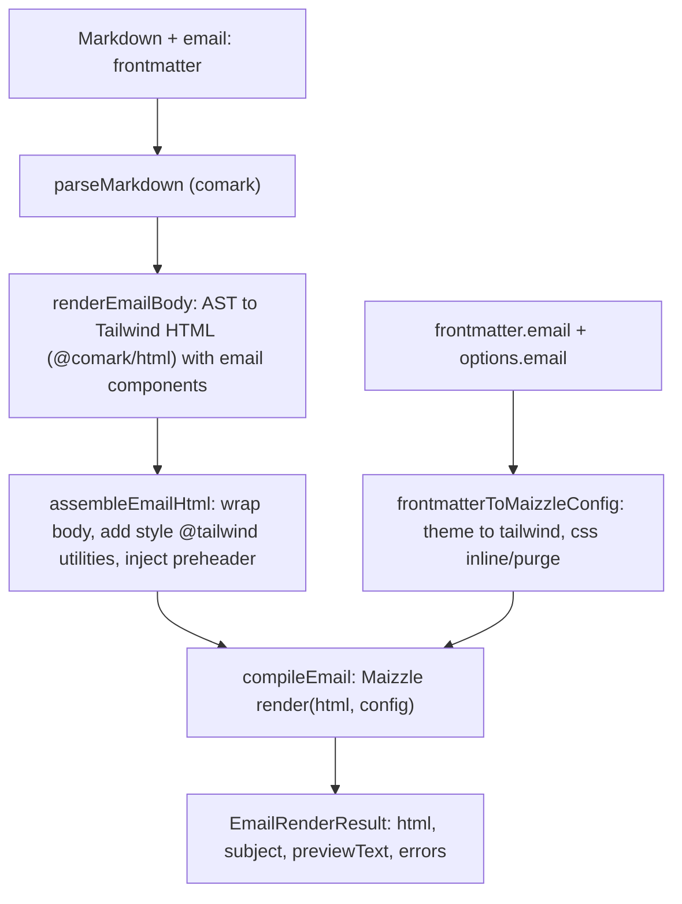

# Add `@comark/email` renderer

## Goal

Create `packages/comark-email/` (`@comark/email`). It converts Comark Markdown to responsive, inline-styled HTML for email clients. It uses Maizzle (classic HTML-string `render(html, config)` API) and Tailwind CSS. The design mirrors the `@comark/pdf` reference package. The runtime is Node-first.

## Design decisions (confirmed)

- Maizzle: classic HTML-string API (pin `@maizzle/framework` to the PostHTML/HTML-string major, e.g. `^4`). Comark renders the AST to HTML with Tailwind classes, then Maizzle inlines the CSS and builds Outlook-safe tables.
- Runtime: Node-first. Browser use is best-effort and documented only.
- `@maizzle/framework` is a direct `dependency` (not an optional peer), because `renderEmail` is the primary API and must work after one install. This is a deliberate difference from `@comark/pdf`, where `pagedjs`/`playwright` were optional add-ons. The import stays lazy so the light assembly path (`assembleEmailHtml`) still loads without it.
- Return shape follows the issue: `renderEmail` returns `{ html, subject, previewText, errors }` (an object), not a plain string like `renderPdf`/`renderHtml`.

## Render flow



## Package structure (mirrors `@comark/pdf`)

Source `packages/comark-email/src/`:

- `index.ts` — `createEmailRenderer`, `renderEmail`; re-export `renderEmailFromDocument`, `assembleEmailHtml`, `renderEmailBody` and types. Analog of `@comark/pdf/src/index.ts`.
- `render.ts` — `renderEmailBody` (renders nodes with the email components merged in, via `renderHtmlFromDocument` from `@comark/html/render`), `assembleEmailHtml` (wraps the body, adds `<style>@tailwind utilities;</style>` plus base CSS, injects the hidden preheader), `renderEmailFromDocument` (reads `document.frontmatter.email`, merges `options.email`, builds the Maizzle config, calls `compileEmail`, returns the result). Re-exports `comark/render`. Analog of `@comark/pdf/src/render.ts`.
- `maizzle.ts` — `compileEmail(html, config)`: lazy `import('@maizzle/framework')`, call `render(html, config)`, return `{ html, errors }`; throw a clear error if the module is missing. Analog of `@comark/pdf/src/node.ts` (the heavy, environment-specific step).
- `config.ts` — `frontmatterToMaizzleConfig(email, extra)` maps `email.theme` colors to `tailwind.theme.extend.colors`, sets `css.inline/purge/shorthand`; `buildPreheader(previewText)` returns a hidden preheader element; `DEFAULT_EMAIL_CSS`. Analog of `@comark/pdf/src/css.ts`.
- `types.ts` — `EmailTheme`, `EmailConfig` (`subject`, `previewText`, `theme`), `EmailRendererOptions` (extends `ParserOptions & RendererOptions`; adds `email?`, `tailwindConfig?`, `maizzleOptions?`, `baseCss?`), `EmailRenderResult` (`{ html, subject?, previewText?, errors }`). Analog of `@comark/pdf/src/types.ts`.
- `parse.ts` — `export * from 'comark/parse'`.
- `utils/index.ts` — `export * from 'comark/utils'`.
- `plugins/email-button.ts`, `plugins/email-columns.ts`, `plugins/email-divider.ts` — each exports a `NodeHandler` that emits email-safe HTML (anchor/table markup) carrying the given Tailwind `class`, plus a no-op default plugin for symmetry. Analog of `@comark/pdf/src/plugins/page-break.ts`.
- `plugins/binding.ts`, `plugins/math.ts`, `plugins/mermaid.ts` — re-export from `@comark/html/plugins/*` (synced by `scripts/sync-plugins.mjs`).

Component handler pattern (from `@comark/pdf/src/plugins/page-break.ts`):

```typescript
export const EmailButton: NodeHandler = ([, attrs, ...children], { render }) =>
  `<a href="${attrs.href ?? '#'}" class="${attrs.class ?? ''}">${/* rendered children */ ''}</a>`
```

`renderEmailBody` merges the three email components before user components, same as `renderPdfBody` merges `PageBreak`:

```typescript
const components = { 'email-button': EmailButton, 'email-columns': EmailColumns, 'email-divider': EmailDivider, ...options?.components }
```

## Package config files (analogs of `@comark/pdf`)

- `package.json` — name `@comark/email`, version `0.1.0`, `type: module`, `sideEffects: false`. Exports: `.`, `./config`, `./render`, `./parse`, `./utils`, `./plugins/*`. Scripts identical to `packages/comark-html/package.json` (`stub`, `build`, `dev`, `test`, `prepack`, `release`). `dependencies`: `comark`, `@comark/html` (both `workspace:*`), `@maizzle/framework` (catalog). `devDependencies`: `vitest` (catalog); `katex`/`beautiful-mermaid` if the math/mermaid plugin tests need them.
- `tsconfig.json` — copy `packages/comark-pdf/tsconfig.json`.
- `vitest.config.ts` — Node-only (single project), unlike PDF's dual browser/node config, because the runtime is Node-first.
- `.release-it.json` — copy the PDF file, replace `pdf` scope with `email`.
- `CHANGELOG.md`, `README.md` — analogs of the PDF files, email wording.

## Monorepo wiring

- `pnpm-workspace.yaml` — add `@maizzle/framework` to the `catalog:`; add any `allowBuilds`/`ignoredBuiltDependencies` entries only if Maizzle pulls a native postinstall.
- Root `package.json` — add `"dev:email": "pnpm --filter comark-email run dev"`; add `@comark/email` to `devDependencies` and to the `@comark/*` `pnpm.overrides`/resolutions block (same two places PDF was added).
- `scripts/sync-plugins.mjs` — add `'comark-email'` to `frameworkPackages`.
- `AGENTS.md` — add a `## Package: @comark/email` section (exports, source layout, usage) and add the package to the monorepo tree and the Package Exports Reference, mirroring the PDF edits.
- `docs/content/3.rendering/9.email.md` — new page modelled on `docs/content/3.rendering/9.pdf.md` (installation, `email:` frontmatter, `renderEmail` usage, email components, plugins). PDF used slot `9`; assign the next free slot if `9` is taken.
- `test/bundle.test.ts` — add the `@comark/email` line to the inline snapshot; refresh the real value with `pnpm prepack && pnpm vitest run bundle -u`.

## Tests (analogs of PDF tests)

- `test/config.test.ts` — `frontmatterToMaizzleConfig` (theme to colors, css defaults), `buildPreheader`, `DEFAULT_EMAIL_CSS`. Analog of `packages/comark-pdf/test/css.test.ts`.
- `test/fixtures/markdown.ts` — `BASIC_EMAIL_MARKDOWN` and `ADVANCED_EMAIL_MARKDOWN` with `email:` frontmatter and the email components. Analog of the PDF fixtures.
- `test/index.test.ts` — `renderEmail` returns `{ html, subject, previewText, errors }`; `subject`/`previewText` come from frontmatter; Tailwind classes are inlined (assert `style="..."` present, utility class removed/inlined); components render; `createEmailRenderer` reuse; `renderEmailFromDocument`. Analog of `packages/comark-pdf/test/index.test.ts`.
- `test/email-components.test.ts` — parse `::email-button` / `::email-columns` / `::email-divider` to AST, check handler output, check render integration. Analog of `packages/comark-pdf/test/page-break.test.ts`.

Note: no browser test file and no `test/output/` (email output is a string), so the `.gitignore` PDF-output entry is not needed.

## Out of scope

No example app, no `@comark/nuxt` module change, and no framework wrappers beyond the plugin re-exports. This matches the scope the PDF PR kept.

## Verify

Run `pnpm install`, then `pnpm --filter comark-email build`, `pnpm --filter comark-email test`, `pnpm lint`, `pnpm typecheck`, and finally refresh the bundle snapshot.
