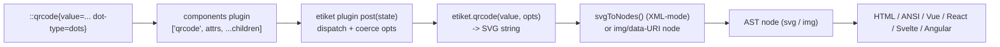

# Add `etiket` barcode/QR plugin (issue #430)

## Architecture (confirmed)

Follow the repo-consistent peer-dependency plugin pattern (`math`/`mermaid` live inside `packages/comark`, not as separate npm packages). The plugin generates at **parse time** and injects a renderer-agnostic AST node, so it works in every renderer (HTML, ANSI, Vue, React, Svelte, Angular) with **no per-framework component**. `etiket` stays an **optional peer dependency**, lazily `import()`-ed once.

## 1. Dependency wiring
- [pnpm-workspace.yaml](pnpm-workspace.yaml): add `etiket: ^0.12.0` to the `catalog:` block (near the other peers, e.g. under "Shared peer dependencies").
- [packages/comark/package.json](packages/comark/package.json): add `etiket` to `peerDependencies` (`catalog:`) + `peerDependenciesMeta.etiket.optional = true` (mirroring `katex`/`beautiful-mermaid`), and add `etiket: catalog:` to `devDependencies` so vitest can import it.
- No `pnpm-workspace.yaml` `packages:` change (already globs `examples/*/*`).

## 2. Core plugin: `packages/comark/src/plugins/etiket.ts`
Model imports/JSDoc on [packages/comark/src/plugins/mermaid.ts](packages/comark/src/plugins/mermaid.ts) and export via `defineComarkPlugin`. Auto-exposed as `comark/plugins/etiket` through the existing `"./plugins/*"` wildcard.

Structure:
- **Directive registry** mapping tag name -> etiket function, giving full parity:
  - 2D: `qrcode`, `microqr`, `rmqr`, `datamatrix`, `gs1datamatrix`, `pdf417`, `micropdf417`, `aztec`, `maxicode`, `dotcode`, `hanxin`, `codablockf`, `code16k`, `jabcode`.
  - 1D + postal: `barcode` (routes all `type=` values incl. `postnet`/`planet`), `postal` (4-state).
  - Helpers (payload builders): `qr-wifi`->`wifi`, `qr-email`->`email`, `qr-sms`->`sms`, `qr-geo`->`geo`, `qr-url`->`url`, `qr-phone`->`phone`, `qr-vcard`->`vcard`, `qr-mecard`->`mecard`, `qr-event`->`event`, `swiss-qr`->`swissQR`, `gs1-digital-link`->`gs1DigitalLink`.
  - Batch: `barcode-sheet`->`barcodeSheet`, `qr-sheet`->`qrcodeSheet` (values from child lines or a `values` JSON attr).
  - **Out of scope (documented, not implemented):** escape hatch `::etiket{fn=…}`, `output=terminal` / `qrcodeTerminal`, raw encoders (`encode*` / `render*`), HIBC/ISBT helpers, etiket CLI.
- **Value source**: `value="..."` attr, else the directive's text children (`::qrcode[https://x]` / block body).
- **Option coercion** (shared): kebab-case attr -> camelCase etiket key (`dot-type`->`dotType`, `ec-level`->`ecLevel`, `show-text`->`showText`, `bar-width`->`barWidth`); coerce numeric/boolean strings; parse JSON attribute values for nested options (`color` gradient, `corners`, `logo`). Block YAML props already arrive typed. Helper directives assemble their object/positional args from prefixed attrs (`first-name`->`firstName`, `ssid`+`password` for wifi, `lat`+`lng` for geo).
- **Frontmatter defaults**: read `state.tree.frontmatter.etiket` and merge under per-directive attrs (per-directive wins). Also merge plugin factory `opts.etiket` defaults.
- **Output modes** (`output=` attr, default from frontmatter/opts):
  - `svg` (default) -> `fn(...)` SVG string -> `svgToNodes()` -> inline SVG subtree (keeps `currentColor` theming).
  - `img`/`svg-uri` -> `*DataURI`/`*Base64` -> single `['img', { src, alt, $:{html:1,block:1} }]`.
  - `png` -> `*PNGDataURI` -> single `img` with `data:image/png;base64,...`.
- **`svgToNodes(svg)`**: new SVG-aware converter. Reuse `htmlparser2` (already a dep) with `xmlMode: true` (preserves `viewBox`, `linearGradient`, self-closing `<path/>`), producing element nodes with `$: { html: 1, block: 1 }` — the same node convention as [htmlToNodes()](packages/comark/src/internal/parse/html/index.ts) but case- and self-close-preserving. Place next to it (e.g. `svgToNodes` in the same html index or a small `internal/parse/html/svg.ts`).
- **Generation hook**: async `post(state)` — dynamic `import('etiket')` once (kept optional; if missing, `console.warn` and leave nodes untouched), then `visit(state.tree, isEtiketTag, node => replaceInPlace(node))`. SVG output is a single `<svg>` root, so mutate the node array in place (`node.length = 0; node.push(...svgRoot)`); img outputs replace similarly.
- **Feature coverage table:** docs page lists Implemented / Partial / Not implemented for every etiket surface area.
- **Soft validation** (issue requirement, matches security-plugin style): call `validateBarcode`/`validateQRInput`/`isValidInput` where applicable; on invalid, `console.warn('[comark/plugins/etiket] ...')` but still attempt generation. Wrap generation in try/catch: on `EtiketError`/any throw, `console.warn` and emit a fallback node (`pre`/`code` with the raw payload) — never throw.
- **Binding limitation**: `:value`/bound attrs cannot be resolved at parse time; such nodes are left unmodified (documented). Optional export of pure helpers (`coerceEtiketOptions`, `svgToNodes`) for unit testing.

## 3. Vitest tests: `packages/comark/test/plugins/etiket.test.ts`
Model on [packages/comark/test/plugins/math.test.ts](packages/comark/test/plugins/math.test.ts); import from `../../src/plugins/etiket` and use `parseMarkdown` from `../../src/parse` plus `renderHtmlForTest` from [packages/comark/test/utils/render-html.ts](packages/comark/test/utils/render-html.ts). Cover:
- `::qrcode{value=...}` -> injected `svg` node; HTML render `toContain('<svg')`.
- `output="png"` -> `img` node whose `src` starts `data:image/png;base64,`.
- `output="img"` -> `img` with `data:image/svg+xml`.
- `::barcode{value="4006381333931" type="ean13" show-text="true"}` -> svg; option coercion (kebab->camel, boolean/number).
- Helper directives: `::qr-wifi{ssid=... password=...}`, `::qr-vcard{first-name=... last-name=...}` -> svg produced.
- Frontmatter `etiket:` defaults applied and per-directive override wins.
- Soft validation: invalid EAN-13 emits `console.warn` (spy) but does not throw and still yields a node.
- Error tolerance: malformed input -> fallback node, no throw.
- Missing peer: parse without `etiket` installed path is guarded (skip or mock) — assert no throw.

## 4. Example app: `examples/3.plugins/vue-vite-etiket/`
Mirror [examples/3.plugins/vue-vite-mermaid](examples/3.plugins/vue-vite-mermaid) exactly (files: `package.json`, `vite.config.ts`, `index.html`, `tsconfig.json`, `README.md`, `src/main.ts`, `src/index.css`, `src/App.vue`).
- `package.json` name `comark-vue-vite-etiket`; deps `@comark/vue: workspace:*`, `etiket: catalog:`, tailwind/vue via `catalog:`.
- `src/App.vue`: `import etiket from '@comark/vue/plugins/etiket'` (parser-only re-export, auto-synced), `<Suspense><Markdown :plugins="[etiket()]">{{ markdown }}</Markdown></Suspense>`; demo string showcasing `::qrcode` (styled dot-type/gradient), `::barcode` ean13, a helper (`::qr-wifi`), and `output="png"`.
- No custom Vue component needed (parse-time injection renders as native SVG/img).

## 5. Root script
- [package.json](package.json): add `"dev:etiket": "pnpm --filter comark-vue-vite-etiket run dev"` alongside the other `dev:*` entries (lines 12-33).

## 6. Plugin export sync
- `@comark/*/plugins/etiket` re-exports are generated automatically by [scripts/sync-plugins.mjs](scripts/sync-plugins.mjs) + `pnpm stub` (parser-only plugin, no manual wrapper). Run `pnpm stub` / `pnpm sync-plugins` after adding the source file so the example resolves `@comark/vue/plugins/etiket`.

## 7. Docs (per AGENTS.md checklist)
- [AGENTS.md](AGENTS.md): add `etiket.ts` to the plugins list, add `etiket` to the peer-dependencies table, and add `import etiket from 'comark/plugins/etiket'` (+ framework paths) to the Package Exports Reference.
- Add a plugin doc page under `docs/content/4.plugins/` covering directives, options, output modes, frontmatter defaults, validation behavior, and a feature coverage table (Implemented / Partial / Not implemented).

## Verification
- `cd packages/comark && pnpm vitest run test/plugins/etiket.test.ts`
- `pnpm --filter comark run test` and `pnpm lint` / `pnpm typecheck`
- `pnpm dev:etiket` to smoke-test the example renders codes.
