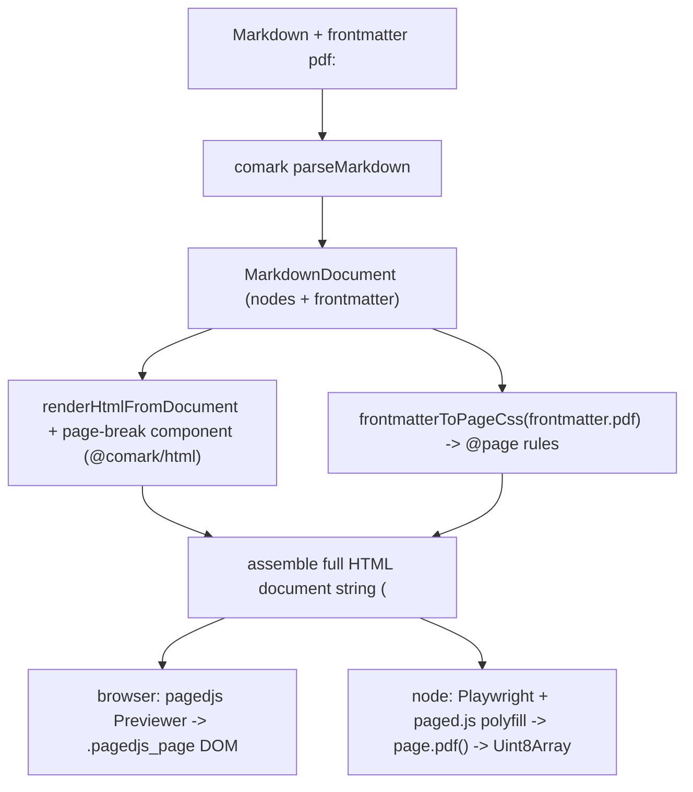

# Add `@comark/pdf` renderer (paged.js)

## Goal

New workspace package `@comark/pdf` at `packages/comark-pdf/` that mirrors [`@comark/html`](packages/comark-html/package.json), reuses its HTML rendering, and adds paged-media output: frontmatter `pdf:` config to `@page` CSS, a `::page-break` component, a browser paginated preview, and a Node headless PDF export.

## Architecture and data flow

Design principle: keep the package a thin wrapper. It depends on `comark` (parse) and `@comark/html` (render), and treats `pagedjs`/`playwright` as optional peers so the base install stays small (mirrors the `katex`/`shiki` peer pattern in [packages/comark-html/package.json](packages/comark-html/package.json)).

## Package skeleton

Create `packages/comark-pdf/` mirroring [`@comark/html`](packages/comark-html/tsconfig.json):

- `package.json` - name `@comark/pdf`, `type: module`, two-pass `tsc` build/prepack/stub scripts copied from html, `"comark": "workspace:*"` and `"@comark/html": "workspace:*"` deps, optional peers `pagedjs` and `playwright` (with `peerDependenciesMeta.optional`), dev deps `pagedjs`/`playwright`/`vitest` from `catalog:`.
- Exports:
  - `.` -> `./dist/index.js` (environment-neutral: parse + assemble paged-media HTML string)
  - `./node` -> `./dist/node.js` (Playwright PDF export; Node-only)
  - `./preview` -> `./dist/preview.js` (browser paged.js Previewer)
  - `./css` -> `./dist/css.js`
  - `./plugins/*`, `./parse`, `./render`, `./utils` (same as html)
- `tsconfig.json` - copy [packages/comark-html/tsconfig.json](packages/comark-html/tsconfig.json), add `"types": ["node"]` (for the Node export path).
- `README.md`, `CHANGELOG.md`, `.release-it.json` - copy html's.

## Source files (`packages/comark-pdf/src/`)

- `types.ts` - `PdfPageConfig` (format/size, orientation, margin as string or `{top,right,bottom,left}`, header, footer, headerRight/... optional), `PdfRendererOptions` (extends `ParserOptions & RendererOptions` with `pdf?`, `baseCss?`), and Node export options (`browser?`, `launchOptions?`, `pdfOptions?`).
- `parse.ts` - `export * from 'comark/parse'` (mirror [packages/comark-html/src/parse.ts](packages/comark-html/src/parse.ts)).
- `render.ts` - `export * from 'comark/render'`; `renderPdfBody(document, options)` that delegates to `renderHtmlFromDocument` from `@comark/html` while injecting the `page-break` component; helper `assemblePagedHtml({ body, css })` producing a complete `<!doctype html>......<body>` string.
- `css.ts` - `frontmatterToPageCss(pdf: PdfPageConfig): string`. Generates `@page { size: <format> <orientation>; margin: <margin>; @top-center { content: ... } @bottom-center { content: ... } }`. Translate footer/header tokens `{{ page }}` -> `counter(page)` and `{{ totalPages }}` -> `counter(pages)`. Include a small default `baseCss` (e.g. `.comark-page-break { break-after: page; }`).
- `index.ts` - public three-tier API mirroring [packages/comark-html/src/index.ts](packages/comark-html/src/index.ts):
  - `createPdfRenderer(options?) => (markdown) => Promise<string>` (returns the assembled paged-media HTML document string): builds the parser once via `createMarkdownParser`, then per call parses, computes `frontmatterToPageCss(doc.frontmatter.pdf)`, renders the body, and assembles.
  - `renderPdf(markdown, options?)` one-shot wrapper.
  - `renderPdfFromDocument(document, options?)` render-only path.
- `preview.ts` (browser) - `paginate(html, target, css?)` using `new Previewer()` from `pagedjs`; returns the paged flow (exposes total page count). Lazy `import('pagedjs')` so importing the package never hard-requires it.
- `node.ts` (Node) - `renderPdfToBuffer(markdown, options?) => Promise<Uint8Array>` and `renderPdfToFile(markdown, path, options?)`:
  - call `renderPdf` for the HTML string;
  - accept an injected `options.browser` (Playwright `Browser`) or lazy `import('playwright')` -> `chromium.launch(options.launchOptions)`;
  - `page.setContent(html)`, set `window.PagedConfig = { after }` hook, `page.addScriptTag({ path: require.resolve('pagedjs/dist/paged.polyfill.js') })`, `page.waitForFunction(() => window.__pagedDone)` (proven `pagedjs-cli` pattern);
  - `page.pdf({ printBackground: true, preferCSSPageSize: true, ...options.pdfOptions })`; close the browser only if this function launched it.
- `plugins/page-break.ts` - export a `PageBreak` `NodeHandler` (emits `

`, honoring an optional `type="before"|"after"` attr) and a default no-op `defineComarkPlugin` (parsing of `::page-break` already works through the core components plugin, confirmed by the AST research: it yields `['page-break', attrs, ...children]`). Re-export `binding`/`math`/`mermaid` component handlers from `@comark/html/plugins/*` so PDF documents can use them without duplicating logic.
- `utils/index.ts` - `export * from 'comark/utils'`.

## Monorepo wiring

- Add `'comark-pdf'` to `frameworkPackages` in [scripts/sync-plugins.mjs](scripts/sync-plugins.mjs) so all parser-only core plugins (shiki, alert, toc, emoji, ...) resolve via `@comark/pdf/plugins/*`.
- Add `"@comark/pdf": "workspace:*"` to `resolutions` in the root [package.json](package.json); optionally add a `"dev:pdf"` script.
- Add `pagedjs` to the `catalog:` in [pnpm-workspace.yaml](pnpm-workspace.yaml) (`playwright` already exists there).
- After first real build, refresh the auto-enumerated snapshot in [test/bundle.test.ts](test/bundle.test.ts) with `pnpm prepack && pnpm vitest run bundle -u` (the package is picked up automatically because it is non-private).

## Tests (`packages/comark-pdf/test/`)

Deterministic, no-browser tests are the core:
- `css.test.ts` - `frontmatterToPageCss` for format/orientation/margin variants and header/footer counter translation.
- `page-break.test.ts` - `::page-break` parses to `['page-break', ...]` and `PageBreak` emits the break element.
- `index.test.ts` - `renderPdf` assembles a full HTML doc with `@page` CSS from frontmatter and the rendered body.

Browser/Node paths (`preview`, `node`) get one guarded smoke test each (CI already installs Chromium via Playwright), skipped when the peer is absent.

## Docs

Per repo rules, after implementation update [AGENTS.md](AGENTS.md) (new package section + Package Exports Reference) and add a `docs/content/3.rendering/` page for the PDF renderer.
