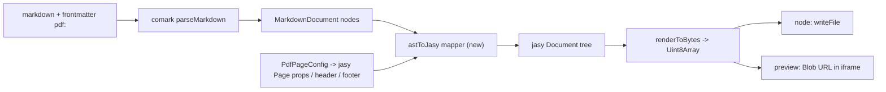

# Replace paged.js with jasy in @comark/pdf

## Why this is a rewrite, not a swap

paged.js consumes HTML/CSS; jasy consumes a declarative component tree (`Document`/`Page`/`Column`/`Row`/`Box`/`Text`/`Paragraph`/`Table`/`Image`/`Divider`) and writes PDF bytes directly on Node. So the entire HTML/CSS layer and the headless browser go away, and a new Comark-AST -> jasy-component mapper replaces them.

## Dependencies and package metadata
- [packages/comark-pdf/package.json](packages/comark-pdf/package.json): remove `@comark/html` dependency and the `pagedjs`/`playwright` peers + `peerDependenciesMeta` + their devDependencies; add `@jasy/pdf` (currently alpha - pin the alpha tag). Update `description`/`keywords` (drop `paged.js`/`print`-via-browser wording). Remove `./css` export; keep `.`, `./node`, `./preview`, `./plugins/*`, `./utils`, `./parse`, `./render`.
- Root [package.json](package.json): fix `dev:pdf` filter to `@comark/pdf` (the PR review already flagged this).
- Catalog/workspace: add `@jasy/pdf` to the pnpm catalog if catalog pins are used.

## New core: AST -> jasy mapper
- New `packages/comark-pdf/src/jasy.ts` (the heart of the change). Walk `MarkdownDocument.nodes` (`ElementNode = [tag, attrs, ...children]`, `TextNode = string`) and return a jasy component tree. Block handlers: `h1-h6` -> `Text` (size/bold by level), `p` -> `Paragraph`, `ul`/`ol`/`li` -> `Column` of bullet/number `Row`s, `blockquote` -> `Box` with padding/left rule, `pre`/`code` block -> `Box(bg)` + monospace `Text`, `hr` -> `Divider`, `table` -> `Table`, `img` -> `Image`, top-level container -> `Column({ gap })`.
- Inline handling: fold inline nodes (`strong`, `em`, `code`, `a`, text) into styled text runs for `Paragraph`. VERIFY jasy's rich-run/inline-span API during implementation; if unavailable, flatten with a documented style-precedence rule. Links map to jasy web-link navigation.
- Keep an extensibility hook mirroring today's `NodeHandler`/`components` option: a `components` map of `tag -> (element, ctx) => JasyNode` so users can override rendering.

## Page config, header/footer, page breaks
- Replace [packages/comark-pdf/src/css.ts](packages/comark-pdf/src/css.ts) with `src/page.ts`: map `PdfPageConfig` (`format`->`size`, `orientation`, `margin`) to jasy `Page` props, and `header*/footer*` (incl. `{{ page }}`/`{{ totalPages }}`) to jasy page header/footer + `Page X of Y` running elements. Delete [packages/comark-pdf/src/pagedjs.d.ts](packages/comark-pdf/src/pagedjs.d.ts) and `test/css.test.ts`.
- [packages/comark-pdf/src/plugins/page-break.ts](packages/comark-pdf/src/plugins/page-break.ts): change `PageBreak` from emitting a CSS `break-*:page` div to emitting jasy's page-break component (honor `type="before|after"`).

## Rendering entry points
- [packages/comark-pdf/src/render.ts](packages/comark-pdf/src/render.ts): drop `assemblePagedHtml`, `renderPdfBody` (HTML) and `DEFAULT_BASE_CSS`. Add `renderPdfDocument(document, options) -> JasyDocument` and `renderPdfBytes(document, options) -> Promise<Uint8Array>` (calls jasy `renderToBytes`). Keep re-export of `comark/render`.
- [packages/comark-pdf/src/index.ts](packages/comark-pdf/src/index.ts): `createPdfRenderer`/`renderPdf` now return `Promise<Uint8Array>` (bytes) instead of an HTML string. Update JSDoc/examples. This is the intended breaking change of the swap.
- [packages/comark-pdf/src/node.ts](packages/comark-pdf/src/node.ts): `renderPdfToBuffer` becomes a thin wrapper over `renderPdfBytes` (no Playwright, no polyfill resolution); `renderPdfToFile` unchanged in shape. Remove `launchBrowser`/`getPagedPolyfillPath`/`runPagedInPage`.
- [packages/comark-pdf/src/preview.ts](packages/comark-pdf/src/preview.ts): `paginate` no longer uses paged.js `Previewer`. New API renders bytes (via `renderPdfBytes`) and mounts them into a target as an `<iframe src=blobURL>` (or `<embed>`), returning a handle with a `revoke()` for the object URL. Requires bundling jasy for the browser - VERIFY jasy runs in-browser (font/AFM assets); if not, fall back to a small opt-in worker/server note in docs.
- [packages/comark-pdf/src/types.ts](packages/comark-pdf/src/types.ts): remove `PdfBrowser`/`PdfPage` and Playwright-specific `PdfNodeOptions` fields (`browser`, `launchOptions`, `pdfOptions`); keep `PdfPageConfig`/`PdfMargin`; add any jasy-specific options (e.g. `fonts`, default text style). `baseCss` becomes obsolete - drop it.

## Plugin degradation (confirmed)
- shiki/highlight, katex math, mermaid emit HTML and cannot feed jasy. In the jasy path, code blocks render as monospace `Text` in a `Box`; math and mermaid fenced/inline nodes render as plain `Text` (their source). Update [packages/comark-pdf/src/plugins/math.ts](packages/comark-pdf/src/plugins/math.ts) and [packages/comark-pdf/src/plugins/mermaid.ts](packages/comark-pdf/src/plugins/mermaid.ts) so they no longer re-export the HTML component wrappers; document the limitation.

## Tests, example, docs
- Update tests: [packages/comark-pdf/test/index.test.ts](packages/comark-pdf/test/index.test.ts), [packages/comark-pdf/test/node.test.ts](packages/comark-pdf/test/node.test.ts), [packages/comark-pdf/test/page-break.test.ts](packages/comark-pdf/test/page-break.test.ts) to assert on jasy trees / PDF bytes (valid `%PDF` header, page count) rather than HTML/paged.js. Replace `test/preview.browser.test.ts` with an iframe/blob-URL assertion. Remove `test/css.test.ts`. Fixtures in [packages/comark-pdf/test/fixtures/markdown.ts](packages/comark-pdf/test/fixtures/markdown.ts) stay usable.
- Vite example `examples/2.vite/pdf/src/main.ts`: replace `splitPagedHtml`/`paginate(preview,...)` with `renderPdf(markdown)` -> bytes -> iframe blob URL; drop katex/paged CSS wiring. Update its `README.md`, `package.json` deps.
- Docs: [docs/content/3.rendering/9.pdf.md](docs/content/3.rendering/9.pdf.md) and `docs/content/8.examples/2.vite/pdf.md` - rewrite setup (install `@jasy/pdf`, remove `pagedjs`/`playwright install chromium` steps), update API/return-type (bytes), note plugin degradation. Update [packages/comark-pdf/README.md](packages/comark-pdf/README.md) and CHANGELOG.
- Update the `@comark/pdf` section in [AGENTS.md](AGENTS.md) (source layout, peers table, usage snippets) and refresh the bundle-size snapshot in [test/bundle.test.ts](test/bundle.test.ts) via `pnpm prepack && pnpm vitest run bundle -u`.

## Verify
- `pnpm --filter @comark/pdf test`, then `pnpm verify` (lint + test + typecheck). Manually open a generated `.pdf` to confirm multi-page layout, headers/footers, tables and page breaks.

## Key risks
- jasy is alpha; markdown-construct coverage (nested lists, table alignment, inline rich runs, images) may need iteration.
- Inline styled runs and in-browser jasy for preview are the two spots to validate against jasy docs early; both have documented fallbacks above.
- Return-type change (HTML string -> `Uint8Array`) is breaking for the unreleased `0.1.0` package - acceptable since it is not yet published/merged.
