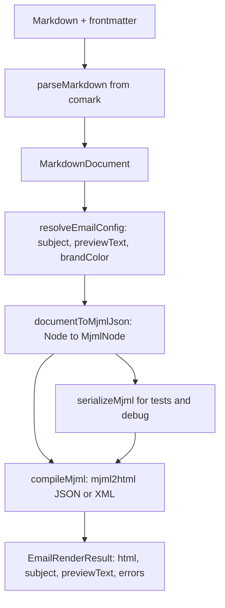

# Replace Maizzle with MJML in `@comark/email`

The package lives at [`packages/comark-email`](packages/comark-email), not `packages/email`. The AST comes from `comark` (`MarkdownDocument` / `Node`), not `@comark/core`. This is a **breaking 0.1.0 → 0.2.0** change. There is no Maizzle fallback.

## Target flow



Do not send the full document through [`renderHtmlFromDocument`](packages/comark-html/src/render.ts). Use `@comark/html` only for **inner HTML** of `mj-text` / `mj-table` / `mj-raw` (inline tags, lists, custom components such as Math).

## Phase 1 — Dependencies and types

**Catalog and package**

- In [`pnpm-workspace.yaml`](pnpm-workspace.yaml): remove `@maizzle/framework`. Add `mjml: ^5.4.0` and `@types/mjml: ^5.0.0`.
- In [`packages/comark-email/package.json`](packages/comark-email/package.json):
  - Remove `@maizzle/framework`.
  - Add `mjml` as a **dependency** (same reason Maizzle was a dependency: `renderEmail` must work after one install).
  - Add `@types/mjml` as a **devDependency** (do not leak MJML types on the public API).
  - Keep `comark` and `@comark/html` (`workspace:*`).
  - Update description and keywords (`mjml` instead of `maizzle` / `tailwindcss`).

MJML 5 is the maintained line. `mjml2html` is **async**. It accepts an MJML XML string **or** a JSON tree. Default `validationLevel` is `soft`. Keep `ignoreIncludes: true` so Markdown cannot include files.

**Types** in [`packages/comark-email/src/types.ts`](packages/comark-email/src/types.ts):

```ts
export interface EmailTheme {
  primary?: string
  background?: string
  [key: string]: string | undefined
}

export interface EmailConfig {
  subject?: string
  previewText?: string
  brandColor?: string
  theme?: EmailTheme
}

export interface MjmlCompileOptions {
  validationLevel?: 'strict' | 'soft' | 'skip'
  beautify?: boolean
  minify?: boolean
  fonts?: Record<string, string>
  keepComments?: boolean
}

export interface EmailRendererOptions extends ParserOptions, RendererOptions {
  email?: EmailConfig
  mjmlOptions?: MjmlCompileOptions
  headCss?: string
}

export interface MjmlCompileError {
  line?: number
  message: string
  tagName?: string
  formattedMessage?: string
}

export interface EmailRenderResult {
  html: string
  subject?: string
  previewText?: string
  errors: MjmlCompileError[]
}

export interface MjmlNode {
  tagName: string
  attributes: Record<string, string>
  children?: MjmlNode[]
  content?: string
}
```

Remove `tailwindConfig`, `maizzleOptions`, and `baseCss`. Map old `baseCss` to `headCss` (`<mj-style>`).

**Frontmatter merge** (keep the `email:` key; also read top-level aliases):

1. `frontmatter.subject` / `previewText` / `brandColor`
2. `frontmatter.email.*`
3. `options.email` (last write wins)

`brandColor` falls back to `theme.primary`. `theme.background` sets `mj-body` `background-color`.

## Phase 2 — Compiler wrapper

Replace [`packages/comark-email/src/maizzle.ts`](packages/comark-email/src/maizzle.ts) with [`packages/comark-email/src/mjml.ts`](packages/comark-email/src/mjml.ts):

- Lazy `import('mjml')`. Handle CJS default export (`mod.default ?? mod`).
- `compileMjml(input: string | MjmlNode, options?: MjmlCompileOptions)` calls `await mjml2html(input, { validationLevel: 'soft', ignoreIncludes: true, ...options })`.
- Map MJML errors to `MjmlCompileError[]`. On throw, push the error and return empty `html` only if MJML gives no HTML; prefer the `html` MJML already returned.
- Clear install error if `mjml` is missing.

Prefer **JSON input** to `mjml2html` so attribute escaping is not done twice. Keep XML serialize for tests.

## Phase 3 — AST to MJML transformer

Add:

- [`packages/comark-email/src/transform.ts`](packages/comark-email/src/transform.ts) — `documentToMjmlJson`, `nodesToMjmlNodes`
- [`packages/comark-email/src/serialize.ts`](packages/comark-email/src/serialize.ts) — `serializeMjml(node): string` (escape `& < > "` in text and attributes)
- Rewrite [`packages/comark-email/src/config.ts`](packages/comark-email/src/config.ts): drop Tailwind/Maizzle helpers. Add `resolveEmailConfig` and `buildMjmlHead(config, headCss?): MjmlNode`.

**Head** (`<mj-head>`):

- `mj-title` from `subject`
- `mj-preview` from `previewText` (replace `buildPreheader`)
- `mj-attributes`: `mj-all` font-family Arial/sans-serif; `mj-button` `background-color` = `brandColor`; `mj-body` `background-color` from theme
- `mj-style` from `headCss` when set

**Body layout (section flush):**

MJML does not allow `mj-button` inside `mj-text`. Walk top-level nodes. Keep a current `mj-section > mj-column`. Flush and open a new section when a node needs a full section (`email-columns`, or a custom block that returns a section).

**Standard node map**

- `h1`–`h6` → `mj-text` with fixed font-size/font-weight; inner HTML from children
- `p` / `blockquote` → `mj-text` (blockquote: padding-left)
- `ul` / `ol` / `li` → one `mj-text` whose `content` is HTML from `@comark/html`
- `pre` / `code` (block) → `mj-text` with monospace font-family
- `table` → `mj-table` with HTML table `content`
- `img` as a block (or only child of `p`) → `mj-image` (`src`, `alt`, `href`)
- `hr` → `mj-divider`
- `a`, `strong`, `em`, `del`, `code`, `br`, `span` → HTML inside parent `mj-text`
- comment nodes → skip
- HTML blocks (`$.html === 1`) → `mj-raw`
- unknown custom tags → render with the HTML `NodeHandler` (or `renderHtmlFromDocument` on that subtree) and wrap in `mj-raw`

Inner HTML helper: a small `renderInlineHtml(nodes, options)` that calls `renderHtmlFromDocument` on a fragment so we do not reimplement `strong` / `em` / `a`.

## Phase 4 — Email directives to native MJML

Rewrite the three plugins. They stay no-op parser plugins (core `components` already parses `::name`). Export `*ToMjml` helpers used by the transformer. Do not emit Tailwind `<a>` / `<table>` HTML.

[`packages/comark-email/src/plugins/email-button.ts`](packages/comark-email/src/plugins/email-button.ts)

- `::email-button` → `mj-button`
- Attributes: `href` (default `#`), `background-color`, `color`, `align`, `border-radius`, `font-size`, `width`, `target`; `class` → `css-class`
- Children become button `content` (inline HTML)

[`packages/comark-email/src/plugins/email-columns.ts`](packages/comark-email/src/plugins/email-columns.ts)

- `::email-columns` → `mj-section`
- Each direct child → `mj-column` that contains the transformed child nodes
- Optional section attrs: `background-color`, `padding`, `css-class`

[`packages/comark-email/src/plugins/email-divider.ts`](packages/comark-email/src/plugins/email-divider.ts)

- `::email-divider` → `mj-divider`
- Attributes: `border-color`, `border-width`, `padding`, `css-class`

This is a breaking Markdown change: Tailwind `class="bg-primary text-white"` is not compiled. Document MJML attributes. `class` still becomes `css-class` only.

## Phase 5 — Public API and render wiring

Rewrite [`packages/comark-email/src/render.ts`](packages/comark-email/src/render.ts) and [`packages/comark-email/src/index.ts`](packages/comark-email/src/index.ts).

**Remove:** `assembleEmailHtml`, `renderEmailBody` (HTML+Tailwind), `frontmatterToMaizzleConfig`, `DEFAULT_EMAIL_CSS`, `buildPreheader`.

**Keep / add:**

- `createEmailRenderer(options)` — parse once, then compile
- `renderEmail(source, options)` — if `source` is `string`, parse then compile; if `MarkdownDocument`, skip parse (this matches `renderEmail(doc, options)` and keeps the Markdown helper)
- `renderEmailFromDocument(doc, options)` — resolve config → `documentToMjmlJson` → `compileMjml` → `EmailRenderResult`
- `documentToMjml(doc, options)` — XML string (tests and debug)
- `compileMjml` re-export

`renderEmailFromDocument` steps:

1. `emailConfig = resolveEmailConfig(document.frontmatter, options)`
2. `mjmlJson = await documentToMjmlJson(document, { ...options, email: emailConfig })`
3. `{ html, errors } = await compileMjml(mjmlJson, options?.mjmlOptions)`
4. Return `{ html, subject: emailConfig.subject, previewText: emailConfig.previewText, errors }`

Exports map stays the same (`.`, `./config`, `./render`, `./parse`, `./plugins/*`, `./utils`).

## Phase 6 — Tests

Rewrite fixtures in [`packages/comark-email/test/fixtures/markdown.ts`](packages/comark-email/test/fixtures/markdown.ts): drop Maizzle wording and Tailwind classes; use MJML attributes (`background-color`, `border-color`). Put `brandColor` on `email:`.

**[`test/transform.test.ts`](packages/comark-email/test/transform.test.ts)** (new, AST → MJML)

- Empty body still emits `<mjml><mj-body>…`
- `# Hello **World**` → `mj-text` with `<strong>`
- Link, emphasis, inline code inside `mj-text`
- Block image → `mj-image` with `src` and `alt`
- `---` / `hr` → `mj-divider`
- List → `mj-text` containing `<ul>` or `<ol>`
- GFM table → `mj-table`
- `subject` → `mj-title`; `previewText` → `mj-preview`
- `brandColor` → `mj-button` default `background-color` in `mj-attributes`
- `theme.background` → `mj-body` `background-color`
- Text and attributes escape `<`, `&`, `"`
- `::email-columns` is a sibling `mj-section`, not nested in the default column
- Unknown `::note` with a custom HTML component → `mj-raw`

**[`test/email-components.test.ts`](packages/comark-email/test/email-components.test.ts)**

- Parse `::email-button` / `::email-columns` / `::email-divider` (keep existing AST assertions)
- `emailButtonToMjml`: `mj-button`, default `href="#"`, `href` and `background-color` passthrough, `class` → `css-class`
- Columns: two children → two `mj-column`
- Divider: `mj-divider`, `border-color` passthrough
- Full `documentToMjml` on sample Markdown contains the native tags (not `comark-email-columns` / `<hr>`)

**[`test/index.test.ts`](packages/comark-email/test/index.test.ts)** (integration, compiled HTML)

- Result keys: `html`, `subject`, `previewText`, `errors`
- HTML is a full document (`<!doctype html>`, `<body>`, body text)
- Frontmatter subject / previewText; `options.email` overrides subject
- Preview appears in compiled output (MJML preview markup)
- Custom component still renders
- `headCss` appears in the HTML
- BASIC fixture: subject, preview, no errors
- ADVANCED fixture: button `href`, column content, divider present
- Math plugin: output contains `katex` when `Math` is passed
- `createEmailRenderer` reuse
- `renderEmailFromDocument` from a parsed doc
- Soft validation: `errors` is an array (empty on valid input)

**[`test/config.test.ts`](packages/comark-email/test/config.test.ts)**

- Merge order: top-level → `email:` → `options.email`
- `brandColor` vs `theme.primary` fallback
- Head JSON: title, preview, attributes, optional `mj-style`

Delete Maizzle/Tailwind assertions (`frontmatterToMaizzleConfig`, `comark-email-columns`, `display:none` preheader, `@tailwind`).

## Phase 7 — Docs and monorepo wiring

- [`docs/content/3.rendering/9.email.md`](docs/content/3.rendering/9.email.md): MJML install (`mjml` only, not Maizzle), frontmatter (`brandColor`), component attributes, `mjmlOptions`, `headCss`, error array from the MJML validator. Link to https://mjml.io.
- [`packages/comark-email/README.md`](packages/comark-email/README.md) and [`CHANGELOG.md`](packages/comark-email/CHANGELOG.md): breaking notes (engine, options, component attrs).
- [`AGENTS.md`](AGENTS.md) Package `@comark/email` tree and render-flow paragraph.
- [`examples/2.vite/email`](examples/2.vite/email): README and sample Markdown (Maizzle → MJML). The Vite `/api/render` path can stay; it already calls `renderEmail`.
- [`test/bundle.test.ts`](test/bundle.test.ts): refresh the `@comark/email` snapshot after `pnpm prepack` (MJML is a dependency, so packed size will change).

Do not add a new example app. Do not add framework wrappers.

## Verify

1. `pnpm install`
2. `pnpm --filter @comark/email test`
3. `pnpm --filter @comark/email build`
4. `pnpm lint` and `pnpm typecheck`
5. `pnpm prepack && pnpm vitest run bundle -u` for the bundle snapshot

## Out of scope

- Dual-engine / Maizzle compatibility
- Tailwind class-to-MJML mapping
- Browser MJML (`mjml-browser`)
- New directives (`::email-column`, hero, social)
- Changing `scripts/sync-plugins.mjs` (email stays in `frameworkPackages`)
