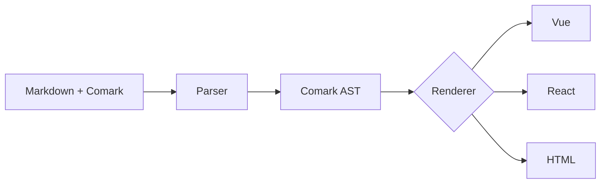

## What is Comark?

**Comark** stands for **M**ark**D**own **C**omponents. It's a syntax extension that lets you use components directly inside your Markdown content:

```mdc
# Welcome to My Blog

This is regular **markdown** with a custom component:

::alert{type="warning"}
This is an important message!
::
```

Comark parses this into an AST that can be rendered by Vue or React, turning your Markdown into fully interactive content.

## Key Features

::card-group
#default
  ::card{icon="i-lucide-zap" title="Fast Parsing"}
  Optimized parser that handles large documents efficiently with minimal memory usage.
  ::

  ::card{icon="i-lucide-component" title="Component Syntax"}
  Embed custom components in Markdown with props, slots, and nested children.
  ::

  ::card{icon="i-lucide-radio" title="Streaming Support"}
  Real-time incremental parsing for AI chat interfaces and live content.
  ::

  ::card{icon="i-lucide-code" title="Framework Agnostic"}
  First-class support for both Vue and React with dedicated renderers.
  ::

  ::card{icon="i-lucide-palette" title="Syntax Highlighting"}
  Built-in Shiki integration for beautiful code blocks with theme support.
  ::

  ::card{icon="i-lucide-file-text" title="GFM Support"}
  Full GitHub Flavored Markdown support including tables, task lists, and more.
  ::
::

## Quick Example

Here's how simple it is to render Comark content:

::code-group

```vue [Vue]
<script setup>
import { Comark } from 'comark/vue'
import Alert from './Alert.vue'

const content = `
# Hello World

::alert{type="info"}
Welcome to Comark!
::
`
</script>

<template>
  <Comark :markdown="content" :components="{ Alert }" />
</template>
```

```tsx [React]
import { Comark } from 'comark/react'
import Alert from './Alert.tsx'

const content = `
# Hello World

::alert{type="info"}
Welcome to Comark!
::
`

export default function App() {
  return <Comark markdown={content} components={{ Alert }} />
}
```

::

## When to Use Comark

Comark is ideal for:

- **Documentation sites** - Write docs in Markdown with interactive examples
- **Blog platforms** - Rich content with custom components for callouts, embeds, and more
- **AI chat interfaces** - Stream and render Markdown responses in real-time
- **CMS integrations** - Let content editors use components without touching code
- **Technical writing** - Combine prose with live code examples and diagrams

## How It Works



1. **Parse** - Comark parses your content into a compact [Comark AST](/syntax/comark-ast)
2. **Transform** - The AST can be manipulated, cached, or serialized
3. **Render** - Framework-specific renderers convert the AST to Vue or React components

## Comparison with Other Tools

| Feature | Comark | MDX | Markdoc |
|---------|------------|-----|---------|
| Streaming support | :icon{name="i-lucide-check" class="text-green-500"} | :icon{name="i-lucide-x" class="text-red-500"} | :icon{name="i-lucide-x" class="text-red-500"} |
| Vue support | :icon{name="i-lucide-check" class="text-green-500"} | :icon{name="i-lucide-x" class="text-red-500"} | :icon{name="i-lucide-check" class="text-green-500"} |
| React support | :icon{name="i-lucide-check" class="text-green-500"} | :icon{name="i-lucide-check" class="text-green-500"} | :icon{name="i-lucide-check" class="text-green-500"} |
| No build step | :icon{name="i-lucide-check" class="text-green-500"} | :icon{name="i-lucide-x" class="text-red-500"} | :icon{name="i-lucide-check" class="text-green-500"} |
| Compact AST | :icon{name="i-lucide-check" class="text-green-500"} | :icon{name="i-lucide-x" class="text-red-500"} | :icon{name="i-lucide-x" class="text-red-500"} |
| Auto-close for streams | :icon{name="i-lucide-check" class="text-green-500"} | :icon{name="i-lucide-x" class="text-red-500"} | :icon{name="i-lucide-x" class="text-red-500"} |

## Next Steps

Ready to get started? Follow these guides:

::card-group{cols="2"}
#default
  ::card{icon="i-lucide-download" title="Installation" to="/getting-started/installation"}
  Install Comark in your project
  ::

  ::card{icon="i-lucide-book-open" title="Comark" to="/syntax/markdown"}
  Learn the component syntax
  ::

  ::card{icon="i-lucide-layout" title="Vue Rendering" to="/rendering/vue"}
  Render Comark in Vue applications
  ::

  ::card{icon="i-lucide-atom" title="React Rendering" to="/rendering/react"}
  Render Comark in React applications
  ::
::
