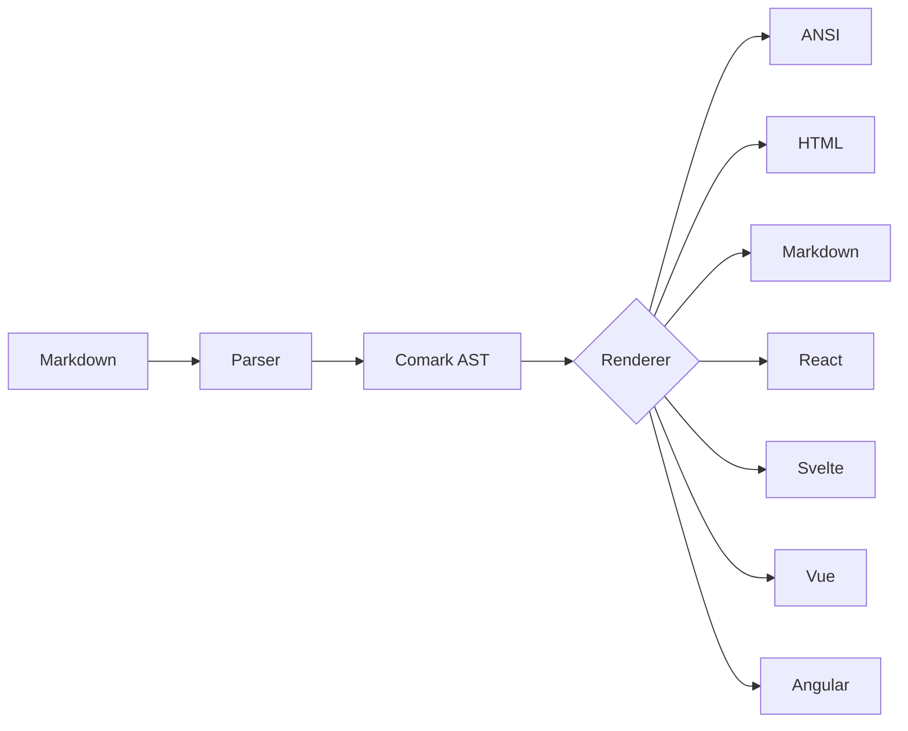

## What is Comark?

**Comark** stands for [**Co**]{.text-primary}mponents in [**Mark**]{.text-primary}down. It's an extension of the Markdown syntax that lets you use components directly inside your Markdown content:

```mdc
# Welcome to my blog

This is regular **markdown** with a custom component:

::alert{type="warning"}
This is an important message!
::
```

The `::alert` is a block component that supports properties and children (also known as slots).

::tip{to="/kb/why-comark"}
Learn why we created Comark and the principles behind its design in [Why Comark](/kb/why-comark).
::

Comark parses this into an [AST](https://en.wikipedia.org/wiki/Abstract_syntax_tree) that can be rendered to [HTML](/rendering/html). It also supports rendering to [Vue](/rendering/vue), [Nuxt](/rendering/nuxt), [React](/rendering/react), [Svelte](/rendering/svelte), and [Angular](/rendering/angular), turning your Markdown into fully interactive content.

::code-group

```vue [Nuxt]
<template>
  <Comark :components="{ Alert }">{{ content }}</Comark>
</template>

<script setup lang="ts">
import Alert from './Alert.vue'

const content = `
# Hello World

::alert{type="info"}
Welcome to Comark!
::
`
</script>
```

```vue [Vue]
<script setup lang="ts">
import { Comark } from '@comark/vue'
import Alert from './Alert.vue'

const content = `
# Hello World

::alert{type="info"}
Welcome to Comark!
::
`
</script>

<template>
  <Comark :components="{ Alert }">{{ content }}</Comark>
</template>
```

```tsx [React]
import { Comark } from '@comark/react'
import Alert from './Alert.tsx'

const content = `
# Hello World

::alert{type="info"}
Welcome to Comark!
::
`

export default function App() {
  return <Comark components={{ Alert }}>{content}</Comark>
}
```

```svelte [Svelte]
<script lang="ts">
  import { Comark } from '@comark/svelte'
  import Alert from './Alert.svelte'

  const content = `
# Hello World

::alert{type="info"}
Welcome to Comark!
::
`
</script>

<Comark markdown={content} components={{ alert: Alert }} />
```

```typescript [Angular]
import { Component } from '@angular/core'
import { ComarkComponent } from '@comark/angular'
import { AlertComponent } from './alert.component'

@Component({
  selector: 'app-root',
  standalone: true,
  imports: [ComarkComponent],
  template: `<comark [markdown]="content" [components]="components" />`,
})
export class AppComponent {
  components = { alert: AlertComponent }
  content = `
# Hello World

::alert{type="info"}
Welcome to Comark!
::
`
}
```

```ts [HTML]
import { parse } from 'comark'
import { renderHTML } from '@comark/html'

const tree = await parse(`
# Hello World

::alert{type="info"}
Welcome to Comark!
::
`)

const html = await renderHTML(tree, {
  components: {
    alert: async ([_tag, attrs, ...children], { render }) => {
      return `<div class="alert alert-${attrs.type}" role="alert">${await render(children)}</div>`
    }
  }
})
/*
<h1>Hello World</h1>
<div class="alert alert-info" role="alert"><p>Welcome to Comark!</p></div>
*/
```
::

## When to Use Comark

Comark is ideal for:

- **Documentation sites** - Write docs in Markdown with interactive examples
- **Blog platforms** - Rich content with custom components for callouts, embeds, and more
- **AI chat interfaces** - Stream and render Markdown responses in real-time
- **CMS integrations** - Let content editors use components without touching code
- **Technical writing** - Combine prose with live code examples and diagrams

## Comparison with Other Tools

For detailed, honest comparisons, see [Comark vs MDX](/compare/comark-vs-mdx), [Comark vs react-markdown](/compare/comark-vs-react-markdown), [Comark vs Streamdown](/compare/comark-vs-streamdown), and [Comark vs Markdoc](/compare/comark-vs-markdoc).

| Feature | Comark | Streamdown | MDX | Markdoc |
|---------|--------|------------|-----|---------|
| Streaming support | :icon{name="i-lucide-check" class="text-green-500"} | :icon{name="i-lucide-check" class="text-green-500"} | :icon{name="i-lucide-x" class="text-red-500"} | :icon{name="i-lucide-x" class="text-red-500"} |
| Component syntax | :icon{name="i-lucide-check" class="text-green-500"} | :icon{name="i-lucide-x" class="text-red-500"} | :icon{name="i-lucide-check" class="text-green-500"} | :icon{name="i-lucide-check" class="text-green-500"} |
| Vue support | :icon{name="i-lucide-check" class="text-green-500"} | :icon{name="i-lucide-x" class="text-red-500"} | :icon{name="i-lucide-x" class="text-red-500"} | :icon{name="i-lucide-check" class="text-green-500"} |
| React support | :icon{name="i-lucide-check" class="text-green-500"} | :icon{name="i-lucide-check" class="text-green-500"} | :icon{name="i-lucide-check" class="text-green-500"} | :icon{name="i-lucide-check" class="text-green-500"} |
| Svelte support | :icon{name="i-lucide-check" class="text-green-500"} | :icon{name="i-lucide-x" class="text-red-500"} | :icon{name="i-lucide-x" class="text-red-500"} | :icon{name="i-lucide-x" class="text-red-500"} |
| Angular support | :icon{name="i-lucide-check" class="text-green-500"} | :icon{name="i-lucide-x" class="text-red-500"} | :icon{name="i-lucide-x" class="text-red-500"} | :icon{name="i-lucide-x" class="text-red-500"} |
| No build step | :icon{name="i-lucide-check" class="text-green-500"} | :icon{name="i-lucide-check" class="text-green-500"} | :icon{name="i-lucide-x" class="text-red-500"} | :icon{name="i-lucide-check" class="text-green-500"} |
| Parse to AST | :icon{name="i-lucide-check" class="text-green-500"} | :icon{name="i-lucide-x" class="text-red-500"} | :icon{name="i-lucide-x" class="text-red-500"} | :icon{name="i-lucide-check" class="text-green-500"} |
| Compact AST | :icon{name="i-lucide-check" class="text-green-500"} | :icon{name="i-lucide-x" class="text-red-500"} | :icon{name="i-lucide-x" class="text-red-500"} | :icon{name="i-lucide-x" class="text-red-500"} |
| Auto-close for streams | :icon{name="i-lucide-check" class="text-green-500"} | :icon{name="i-lucide-check" class="text-green-500"} | :icon{name="i-lucide-x" class="text-red-500"} | :icon{name="i-lucide-x" class="text-red-500"} |
| Decoupled parsing & rendering | :icon{name="i-lucide-check" class="text-green-500"} | :icon{name="i-lucide-x" class="text-red-500"} | :icon{name="i-lucide-x" class="text-red-500"} | :icon{name="i-lucide-check" class="text-green-500"} |

## Key Features

::card-group
#default
  ::card{icon="i-lucide-zap" title="Fast Parsing" to="/api/parse"}
  Built on markdown-exit, producing a compact array-based AST you can cache, serialize, and send over the wire.
  ::

  ::card{icon="i-lucide-component" title="Component Syntax" to="/syntax/components"}
  Embed custom components in Markdown with props, slots, and nested children.
  ::

  ::card{icon="i-lucide-radio" title="Streaming Support" to="/rendering/vue#streaming"}
  Real-time incremental parsing for AI chat interfaces and live content.
  ::

  ::card{icon="i-lucide-code" title="Framework Agnostic" to="/getting-started/installation"}
  First-class support for Vue, React, Svelte, and Angular with dedicated renderers.
  ::

  ::card{icon="i-lucide-palette" title="Syntax Highlighting" to="/plugins/built-in/syntax-highlight"}
  Built-in Shiki integration for beautiful code blocks with theme support.
  ::

  ::card{icon="i-lucide-file-text" title="GFM Support" to="/syntax/markdown"}
  Full GitHub Flavored Markdown support including tables, task lists, and more.
  ::
::

## FAQ

::accordion
  :::accordion-item{label="How is Comark different from MDX?"}
  MDX compiles Markdown to JSX at build time, tying content to a bundler and to React. Comark parses component syntax at runtime, so content can come from a database, CMS, or AI stream and render to any framework. See [Comark vs MDX](/compare/comark-vs-mdx).
  :::

  :::accordion-item{label="Does Comark require a specific framework?"}
  No. The core parser is framework-free. Renderers exist for [Vue](/rendering/vue), [React](/rendering/react), [Svelte](/rendering/svelte), [Angular](/rendering/angular), and [Nuxt](/rendering/nuxt), plus string output as [HTML](/rendering/html) and [ANSI](/rendering/ansi).
  :::

  :::accordion-item{label="Can I use markdown-it plugins with Comark?"}
  Yes. Comark is built on markdown-exit, a TypeScript rewrite of markdown-it, so existing markdown-it plugins work alongside [Comark plugins](/plugins). See [using markdown-it plugins](/plugins/custom/markdown-it).
  :::

  :::accordion-item{label="How does Comark handle streaming AI output?"}
  The [auto-close](/api/auto-close) parser completes unterminated syntax (bold, code fences, components) so every incomplete frame renders correctly. Framework renderers expose this as a `streaming` prop.
  :::

  :::accordion-item{label="Do I have to use components?"}
  No. Comark is a superset of CommonMark and GFM, so plain Markdown parses unchanged. Components and [attributes](/syntax/attributes) are opt-in syntax.
  :::
::

## How It Works

::div{.border .border-default .rounded .bg-muted .p-4}

```mermaid
graph LR
    A[Markdown] --> B[Parser]
    B --> C[Comark AST]
    C --> D{Renderer}
    D --> I[ANSI]
    D --> H[HTML]
    D --> J[Markdown]
    D --> F[React]
    D --> G[Svelte]
    D --> E[Vue]
    D --> K[Angular]
```
::

1. **Parse** - Comark parses Markdown into a compact [Comark AST](/syntax/comark-ast)
2. **Transform** - The AST can be manipulated, cached, or serialized
3. **Render** - Framework-specific renderers convert the AST to Vue, React, Svelte or Angular components, or render to string in Markdown, HTML or ANSI.
