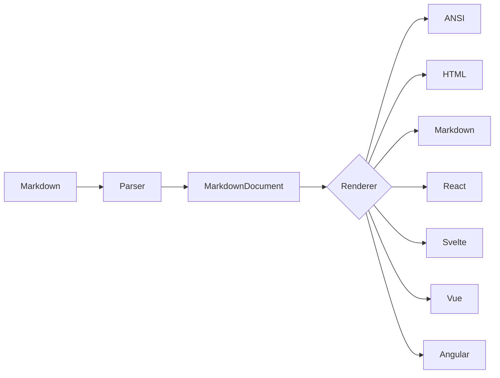

## What is Comark?

**Comark** is a JavaScript library for parsing and rendering Markdown anywhere. Give it standard CommonMark or GitHub Flavored Markdown (GFM), then render the same source to HTML, ANSI, Vue, React, Svelte, or Angular.

Parsing and rendering are decoupled through a compact, serializable [`MarkdownDocument`](/getting-started/document-model). Parse on the server, in the browser, in a worker, during a build, or as content streams in. You can then inspect, transform, cache, serialize, or render the document without tying your content to one output target.

Comark is built on [markdown-exit](https://github.com/serkodev/markdown-exit), a TypeScript rewrite of markdown-it that preserves its plugin API. It combines that foundation with streaming support, an extensible plugin system, and optional component and attribute syntax for richer content.

::callout{to="/kb/why-comark" icon="i-lucide-lightbulb"}
Learn why we created Comark and the principles behind its design in [Why Comark](/kb/why-comark).
::

Start with the renderer that matches your output:

::code-group

```ts [HTML]
import { renderHtml } from '@comark/html'

const content = '# Hello **World**'
const html = await renderHtml(content)
```

```ts [Terminal]
import { renderAnsi } from '@comark/ansi'

const content = '# Hello **World**'
const output = await renderAnsi(content)
```

```vue [Vue]
<script setup lang="ts">
import { Markdown } from '@comark/vue'

const content = '# Hello **World**'
</script>

<template>
  <Suspense>
    <Markdown>{{ content }}</Markdown>
  </Suspense>
</template>
```

```tsx [React]
import { Markdown } from '@comark/react'

const content = '# Hello **World**'

export default function App() {
  return <Markdown>{content}</Markdown>
}
```

```svelte [Svelte]
<script lang="ts">
  import { Markdown } from '@comark/svelte'

  const content = '# Hello **World**'
</script>

<Markdown value={content} />
```

```typescript [Angular]
import { Component } from '@angular/core'
import { Markdown } from '@comark/angular'

@Component({
  selector: 'app-root',
  standalone: true,
  imports: [Markdown],
  template: `<comark-markdown [value]="content" />`,
})
export class AppComponent {
  content = '# Hello **World**'
}
```
::

## How It Works

::div{.border .border-default .rounded .bg-muted .p-4}

```mermaid
graph LR
    A[Markdown] --> B[Parser]
    B --> C[MarkdownDocument]
    C --> D{Renderer}
    D --> I[ANSI]
    D --> H[HTML]
    D --> J[Markdown]
    D --> F[React]
    D --> G[Svelte]
    D --> E[Vue]
    D --> K[Angular]
```
::

1. **Parse** - Comark parses Markdown into a compact [`MarkdownDocument`](/getting-started/document-model)
2. **Transform** - Inspect, transform, cache, or serialize the document
3. **Render** - Convert the document to HTML, ANSI, Markdown, Vue, React, Svelte, or Angular

## Extend Markdown When Needed

Plain Markdown works without any component syntax. When your content needs richer structure, Comark adds readable components and attributes without embedding verbose HTML or executable framework code:

```mdc
# Welcome to my blog

This is regular **Markdown** with a custom component:

::alert{type="warning"}
This is an important message!
::
```

The `::alert` block supports properties, children, and named slots. The renderer only uses components you explicitly register, so the source remains portable data rather than framework-specific code. Learn more in [Component Syntax](/syntax/components) and [Attributes](/syntax/attributes).

## When to Use Comark

Comark is ideal for:

- **Content platforms** - Parse Markdown from files, databases, APIs, or a CMS at build time or runtime
- **Multi-target publishing** - Reuse one source for applications, static HTML, RSS, email, and terminal output
- **AI chat interfaces** - Stream and render incomplete Markdown responses in real time
- **Documentation and blogs** - Combine standard Markdown with callouts, embeds, diagrams, and interactive UI
- **Content pipelines** - Inspect, transform, cache, or serialize a compact document before rendering

## Comparison with Other Tools

For detailed, honest comparisons, see [Comark vs MDX](/compare/comark-vs-mdx), [Comark vs react-markdown](/compare/comark-vs-react-markdown), [Comark vs Streamdown](/compare/comark-vs-streamdown), and [Comark vs Markdoc](/compare/comark-vs-markdoc).

| Feature | Comark | Streamdown | MDX | Markdoc |
|---------|--------|------------|-----|---------|
| Streaming support | :icon{name="i-lucide-check" class="text-green-500"} | :icon{name="i-lucide-check" class="text-green-500"} | :icon{name="i-lucide-x" class="text-red-500"} | :icon{name="i-lucide-x" class="text-red-500"} |
| Component syntax | :icon{name="i-lucide-check" class="text-green-500"} | :icon{name="i-lucide-x" class="text-red-500"} | :icon{name="i-lucide-check" class="text-green-500"} | :icon{name="i-lucide-check" class="text-green-500"} |
| Vue support | :icon{name="i-lucide-check" class="text-green-500"} | :icon{name="i-lucide-x" class="text-red-500"} | :icon{name="i-lucide-x" class="text-red-500"} | :icon{name="i-lucide-check" class="text-green-500"} |
| React support | :icon{name="i-lucide-check" class="text-green-500"} | :icon{name="i-lucide-check" class="text-green-500"} | :icon{name="i-lucide-check" class="text-green-500"} | :icon{name="i-lucide-check" class="text-green-500"} |
| Svelte support | :icon{name="i-lucide-check" class="text-green-500"} | :icon{name="i-lucide-x" class="text-red-500"} | :icon{name="i-lucide-x" class="text-red-500"} | :icon{name="i-lucide-x" class="text-red-500"} |
| Angular support | :icon{name="i-lucide-check" class="text-green-500"} | :icon{name="i-lucide-x" class="text-red-500"} | :icon{name="i-lucide-x" class="text-red-500"} | :icon{name="i-lucide-x" class="text-red-500"} |
| No build step | :icon{name="i-lucide-check" class="text-green-500"} | :icon{name="i-lucide-check" class="text-green-500"} | :icon{name="i-lucide-x" class="text-red-500"} | :icon{name="i-lucide-check" class="text-green-500"} |
| Parse to AST | :icon{name="i-lucide-check" class="text-green-500"} | :icon{name="i-lucide-x" class="text-red-500"} | :icon{name="i-lucide-x" class="text-red-500"} | :icon{name="i-lucide-check" class="text-green-500"} |
| Compact AST | :icon{name="i-lucide-check" class="text-green-500"} | :icon{name="i-lucide-x" class="text-red-500"} | :icon{name="i-lucide-x" class="text-red-500"} | :icon{name="i-lucide-x" class="text-red-500"} |
| Auto-close for streams | :icon{name="i-lucide-check" class="text-green-500"} | :icon{name="i-lucide-check" class="text-green-500"} | :icon{name="i-lucide-x" class="text-red-500"} | :icon{name="i-lucide-x" class="text-red-500"} |
| Decoupled parsing & rendering | :icon{name="i-lucide-check" class="text-green-500"} | :icon{name="i-lucide-x" class="text-red-500"} | :icon{name="i-lucide-x" class="text-red-500"} | :icon{name="i-lucide-check" class="text-green-500"} |

## Core Capabilities

::card-group
#default
  ::card{icon="i-lucide-file-text" title="CommonMark and GFM" to="/syntax/markdown"}
  Parse familiar Markdown syntax, including tables, task lists, code blocks, and more.
  ::

  ::card{icon="i-lucide-layers" title="Parse Once, Render Anywhere" to="/getting-started/document-model"}
  Produce a compact document you can inspect, cache, serialize, and render to every supported target.
  ::

  ::card{icon="i-lucide-radio" title="Streaming Support" to="/rendering/vue#streaming"}
  Real-time incremental parsing for AI chat interfaces and live content.
  ::

  ::card{icon="i-lucide-puzzle" title="Plugin Ecosystem" to="/plugins"}
  Extend parsing with Comark plugins or reuse plugins written for markdown-it.
  ::

  ::card{icon="i-lucide-component" title="Component Syntax" to="/syntax/components"}
  Add props, slots, and nested UI while keeping content as readable plain text.
  ::

  ::card{icon="i-lucide-code" title="Dedicated Renderers" to="/getting-started/installation"}
  Render to HTML, ANSI, Vue, React, Svelte, and Angular without changing the source.
  ::
::

## FAQ

::accordion
  :::accordion-item{label="How is Comark different from MDX?"}
  MDX compiles Markdown to JSX at build time, tying content to a bundler and to React. Comark parses Markdown into serializable data at build time or runtime, then renders it to multiple targets. See [Comark vs MDX](/compare/comark-vs-mdx).
  :::

  :::accordion-item{label="Does Comark require a specific framework?"}
  No. The core parser is framework-free. Renderers exist for [Vue](/rendering/vue), [React](/rendering/react), [Svelte](/rendering/svelte), and [Angular](/rendering/angular), plus string output as [HTML](/rendering/html) and [ANSI](/rendering/ansi).
  :::

  :::accordion-item{label="Can I use markdown-it plugins with Comark?"}
  Yes. Comark is built on markdown-exit, a TypeScript rewrite of markdown-it that preserves its plugin API. Existing markdown-it plugins work alongside [Comark plugins](/plugins). See [using markdown-it plugins](/plugins/custom/markdown-it).
  :::

  :::accordion-item{label="How does Comark handle streaming AI output?"}
  The [auto-close](/reference/auto-close) parser completes unterminated syntax (bold, code fences, components) so every incomplete frame renders correctly. Framework renderers expose this as a `streaming` prop.
  :::

  :::accordion-item{label="Do I have to use components?"}
  No. Comark is a superset of CommonMark and GFM, so plain Markdown parses unchanged. Components and [attributes](/syntax/attributes) are opt-in syntax.
  :::
::
