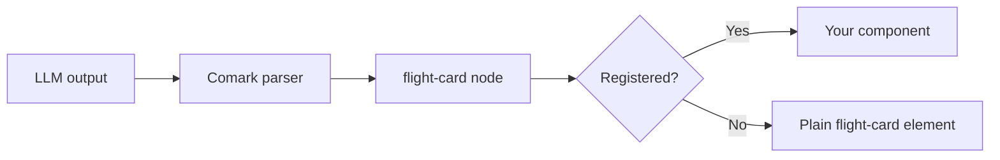

The model writes component syntax, for example `::flight-card{from="CDG" to="JFK" price="342"}`, and your app maps the tag to a real component. Component syntax is data: it runs no code, and only the components that you register render as components. Raw HTML in the output is different: the default `html` plugin keeps a `<script>` element, so enable the [security plugin](#validate-the-output) with `blockedTags` before you render untrusted output.

To give the model a library of components and help it choose between them, see [Intelligent UI](/use-cases/intelligent-ui).

## How it works

Comark parses component syntax into a node, for example `['flight-card', { from: 'CDG', to: 'JFK', price: '342' }]`. The renderer looks up `flight-card` in the `components` prop and renders your component with those props. A tag with no registered component renders as a plain element with the same name, for example `<flight-card from="CDG">`.

The following diagram shows the path from model output to the screen:



## Register the component

Write the component with optional props. During streaming, a prop can be missing until the model writes it:

::code-group

```vue [FlightCard.vue]
<script setup lang="ts">
defineProps<{ from?: string, to?: string, price?: number }>()
</script>

<template>
  <div class="flight-card">
    <strong>{{ from }} → {{ to }}</strong>
    <span v-if="price">${{ price }}</span>
    <slot />
  </div>
</template>
```

```vue [Chat.vue]
<script setup lang="ts">
import { Markdown } from '@comark/vue'
import FlightCard from './FlightCard.vue'

defineProps<{ text: string, isStreaming: boolean }>()

const components = { 'flight-card': FlightCard }
</script>

<template>
  <Suspense>
    <Markdown :value="text" :streaming="isStreaming" :components="components" caret />
  </Suspense>
</template>
```

::

React, Svelte, and Angular use the same `components` map. See [components](/syntax/components) for props, slots, and nesting.

Attribute values are strings. Ask the model for a `:` prefix to get a typed value: `:price="342"` passes the number `342`.

## Tell the model which components exist

A model can't guess your components. List each component, its props, and one example in the system prompt:

```typescript [server/api/chat.post.ts]
const system = `Answer in Markdown. You can use these Comark components:

- ::flight-card — one flight offer. Props: from and to (IATA airport codes), :price (number, USD).
  Example: ::flight-card{from="CDG" to="JFK" :price="342"}
  ::

Don't use other components or raw HTML.`
```

For the full syntax, give the model the Comark syntax guide for agents at [comark.dev/.well-known/skills/comark/references/markdown-syntax.md](https://comark.dev/.well-known/skills/comark/references/markdown-syntax.md).

## Validate the output

Component syntax can name any tag, for example `::script` or `::iframe`. Because unregistered tags render as plain elements, block dangerous tag names with the [security plugin](/plugins/built-in/security):

```typescript
import security from '@comark/vue/plugins/security'

const plugins = [
  security({
    blockedTags: ['script', 'iframe', 'embed', 'form', 'base', 'meta', 'link', 'style', 'object'],
    allowedProtocols: ['https', 'mailto'],
  }),
]
```

The plugin removes blocked tags from raw HTML and from component syntax. It also strips `on*` attributes and unsafe URLs such as `javascript:`. To restrict links to your own domains, add `allowedLinkPrefixes`. Your components also receive props from the model, so validate those values in the component.

A `:`-prefixed prop can also read a path from the render context, for example `:label="data.user.email"`. Don't put secrets in the `data` prop when the content comes from a model.

## Stream components

`autoClose` closes an open component while the model writes it. A frame that ends with `::flight-card{from="CDG"` still parses as a `flight-card` node. Your component renders at once, and gets new props on each frame. Set `streaming` from the part state, as described in [AI chat streaming](/use-cases/ai-chat-streaming).

## Use JSON specs instead

Some models produce structured JSON more reliably than Markdown syntax. The [json-render plugin](/plugins/built-in/json-render) reads a `json-render` or `yaml-render` code block and replaces it with element nodes:

````mdc
```json-render
{ "type": "FlightCard", "props": { "from": "CDG", "to": "JFK", "price": 342 } }
```
````

Each element `type` becomes the tag name, so map `FlightCard` in the `components` prop. JSON values keep their types. Pass `jsonRender()` in `plugins`, from `@comark/vue/plugins/json-render` or the path for your framework.

## FAQ

::accordion
  :::accordion-item{label="Can the model run JavaScript through a component?"}
  No. Component syntax produces data, and Comark passes it to the components that you register. Block `script` and other risky tags, because unregistered tags render as plain elements.
  :::

  :::accordion-item{label="What if the model uses a component I didn't register?"}
  It renders as a plain element with the same tag name and its children. To keep only the tags you expect, set the `allowedTags` option of the security plugin. List your components and the Markdown tags that you allow.
  :::

  :::accordion-item{label="When do I use json-render instead of component syntax?"}
  Use a `json-render` block when your model writes structured JSON more reliably than component syntax. Component syntax mixes text and UI in one answer. Both produce the same kind of nodes.
  :::
::

## Next steps

- [Render streaming Markdown from an LLM](/use-cases/ai-chat-streaming)
- [Component syntax](/syntax/components)
- [Security plugin options](/plugins/built-in/security#options)
- [json-render example](/examples/plugins/vue-vite-json-render)
