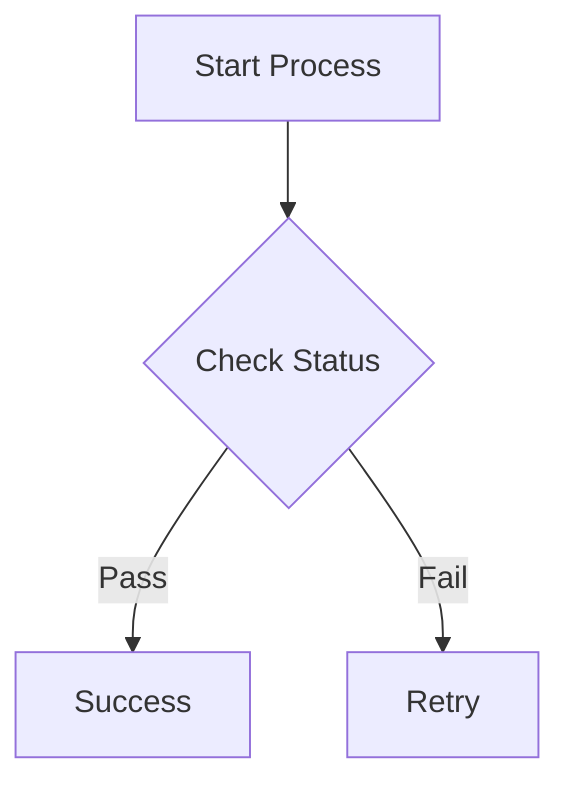
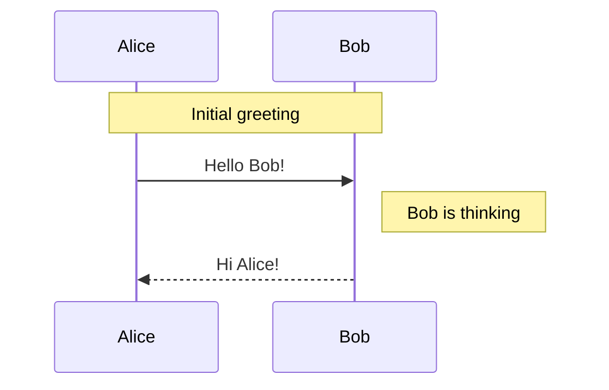

# Mermaid Diagrams

The `@comark/mermaid` plugin enables rendering of [Mermaid](https://mermaid.js.org/) diagrams in your markdown content. Mermaid lets you create diagrams and visualizations using text and code.

## Installation

::code-group

```bash [npm]
npm install @comark/mermaid
```

```bash [pnpm]
pnpm add @comark/mermaid
```

```bash [yarn]
yarn add @comark/mermaid
```

::

## Basic Usage

### With Vue

```vue
<script setup>
import { Comark } from 'comark/vue'
import mermaidPlugin from '@comark/mermaid'
import { Mermaid } from '@comark/mermaid/vue'

const markdown = `
\`\`\`mermaid
graph TD
    A[Start] --> B[End]
\`\`\`
`
</script>

<template>
  <Suspense>
    <Comark
      :components="{ mermaid: Mermaid }"
      :options="{ plugins: [mermaidPlugin()] }"
    >{{ markdown }}</Comark>
  </Suspense>
</template>
```

### With React

```tsx
import { Comark } from 'comark/react'
import mermaidPlugin from '@comark/mermaid'
import { Mermaid } from '@comark/mermaid/react'

const markdown = `
\`\`\`mermaid
graph TD
    A[Start] --> B[End]
\`\`\`
`

function App() {
  return (
    <Comark
      components={{ mermaid: Mermaid }}
      options={{ plugins: [mermaidPlugin()] }}
    >{markdown}</Comark>
  )
}
```

### With Parse API

```typescript
import { parse } from 'comark'
import mermaidPlugin from '@comark/mermaid'

const result = await parse(`
\`\`\`mermaid
graph TD
    A --> B
\`\`\`
`, {
  plugins: [mermaidPlugin()]
})
```

## Diagram Types

Mermaid supports many diagram types:

### Flowcharts

```mdc
\`\`\`mermaid
graph TD
    A[Start] --> B{Is it working?}
    B -->|Yes| C[Great!]
    B -->|No| D[Debug]
    D --> A
\`\`\`
```

### Sequence Diagrams

```mdc
\`\`\`mermaid
sequenceDiagram
    participant Alice
    participant Bob
    Alice->>Bob: Hello Bob!
    Bob-->>Alice: Hello Alice!
\`\`\`
```

### Class Diagrams

```mdc
\`\`\`mermaid
classDiagram
    Animal <|-- Duck
    Animal <|-- Fish
    Animal : +int age
    Animal : +String gender
    Animal: +isMammal()
\`\`\`
```

### State Diagrams

```mdc
\`\`\`mermaid
stateDiagram-v2
    [*] --> Still
    Still --> [*]
    Still --> Moving
    Moving --> Still
    Moving --> Crash
    Crash --> [*]
\`\`\`
```

### Gantt Charts

```mdc
\`\`\`mermaid
gantt
    title Project Timeline
    dateFormat  YYYY-MM-DD
    section Planning
    Task 1           :a1, 2024-01-01, 30d
    Task 2           :after a1, 20d
\`\`\`
```

### Pie Charts

```mdc
\`\`\`mermaid
pie title Pets
    "Dogs" : 386
    "Cats" : 85
    "Rats" : 15
\`\`\`
```

### Git Graphs

```mdc
\`\`\`mermaid
gitGraph
    commit
    branch develop
    checkout develop
    commit
    checkout main
    merge develop
\`\`\`
```

### ER Diagrams

```mdc
\`\`\`mermaid
erDiagram
    CUSTOMER ||--o{ ORDER : places
    ORDER ||--|{ LINE-ITEM : contains
    CUSTOMER }|..|{ DELIVERY-ADDRESS : uses
\`\`\`
```

### Journey Diagrams

```mdc
\`\`\`mermaid
journey
    title My working day
    section Go to work
      Make tea: 5: Me
      Go upstairs: 3: Me
    section Work
      Do work: 1: Me, Cat
\`\`\`
```

## Configuration

### Component Props

Both Vue and React `Mermaid` components accept these props:

| Prop | Type | Default | Description |
|------|------|---------|-------------|
| `content` | `string` | required | The Mermaid diagram code |
| `class` | `string` | `''` | CSS classes for styling |
| `theme` | `string` | `'default'` | Mermaid theme |
| `width` | `string` | `'100%'` | Container width |
| `height` | `string` | `'400px'` | Container height |

**Example with props:**

```vue
<Mermaid
  :content="diagramCode"
  theme="dark"
  width="800px"
  height="600px"
/>
```

You can also pass component props directly using special code block syntax.

~~~

~~~

## Performance Tips

1. **Lazy Loading**: Consider lazy loading mermaid for pages with many diagrams
2. **Code Splitting**: Use dynamic imports for the mermaid library
3. **Caching**: Diagrams are rendered client-side; consider pre-rendering for static sites
4. **Complexity**: Limit diagram complexity for better performance

## Best Practices

### Use Descriptive IDs


### Add Notes for Context



### Keep Diagrams Simple

Break complex diagrams into multiple smaller ones for better readability.

## Examples

See the [Mermaid example](/examples#mermaid-diagrams) for a complete working implementation.

## Resources

- [Mermaid Documentation](https://mermaid.js.org/intro/)
- [Mermaid Live Editor](https://mermaid.live) - Test diagrams
- [Mermaid Cheat Sheet](https://jojozhuang.github.io/tutorial/mermaid-cheat-sheet/)

## Related

- [Parse API](/api/parse) - Main parsing API
- [Vue Rendering](/rendering/vue) - Using with Vue
- [React Rendering](/rendering/react) - Using with React
