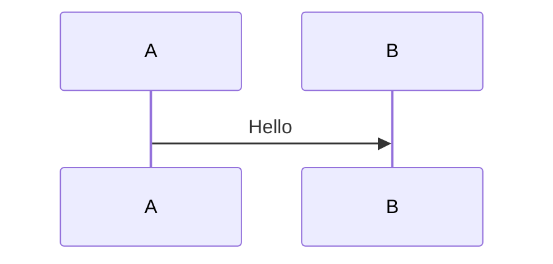

::code-explorer
---
org: comarkdown
repo: comark@8d0c4a8023b71e8588ee6328820a2f26f2285232
path: examples/3.plugins/react-vite-mermaid
defaultValue: src/App.tsx
---
::

## Features

This example demonstrates how to use Comark with Mermaid diagrams in React:

- **Mermaid Plugin**: Import and configure the `mermaid` plugin to parse mermaid code blocks
- **Mermaid Component**: Register the `Mermaid` component to render diagrams as SVG
- **Multiple Diagram Types**: Supports flowcharts, sequence diagrams, class diagrams, and all other Mermaid diagram types
- **Configurable**: Customize theme, width, and height via component props

## Usage

1. Install dependencies:
   ```bash
   npm install @comark/react beautiful-mermaid
   ```

2. Import the mermaid plugin and component:
   ```tsx
   import { MarkdownClient } from '@comark/react'
   import mermaid, { Mermaid } from '@comark/react/plugins/mermaid'
   ```

3. Pass the plugin and component to `MarkdownClient`:
   ```tsx
   <MarkdownClient
     value={content}
     components={{ Mermaid }}
     plugins={[mermaid()]}
   />
   ```

4. Use mermaid code blocks in your markdown:
   ````markdown
   ```mermaid
   graph TD
       A[Start] --> B[End]
   ```
   ````

## Theme support

Pass a theme via the code block info string:

````markdown

````

## Learn more

- [Mermaid Plugin Documentation](/plugins/built-in/mermaid)
- [Mermaid Documentation](https://mermaid.js.org)
- [Comark Documentation](https://comark.dev)
