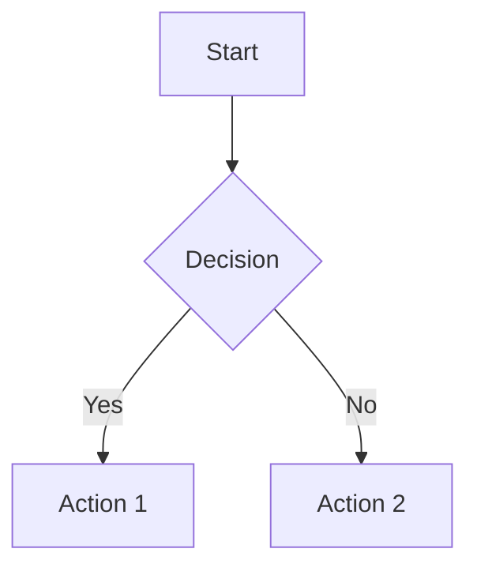
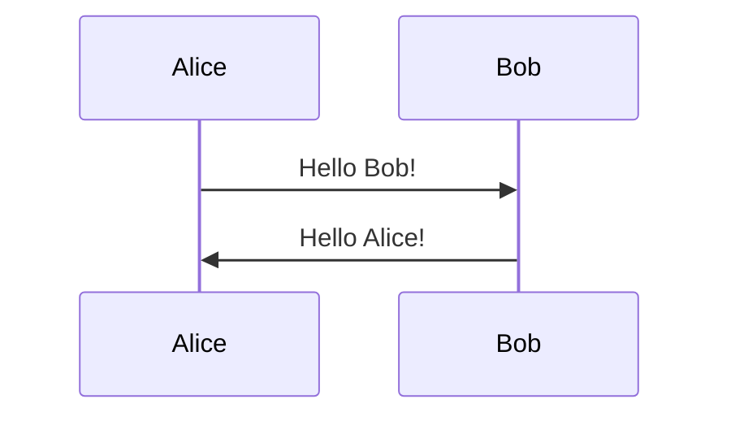
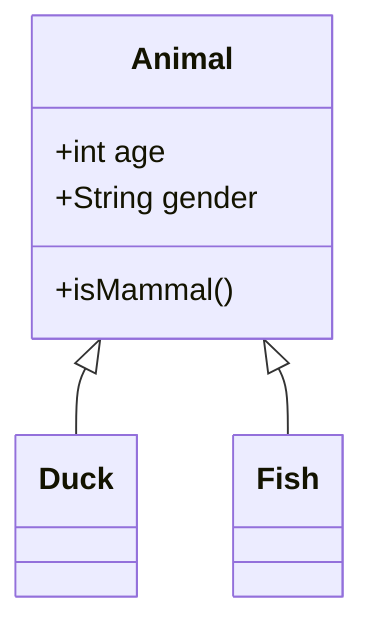
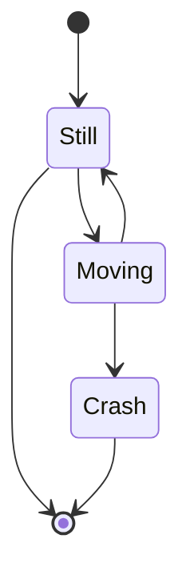
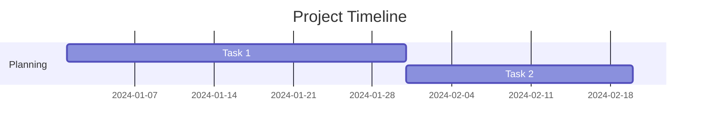
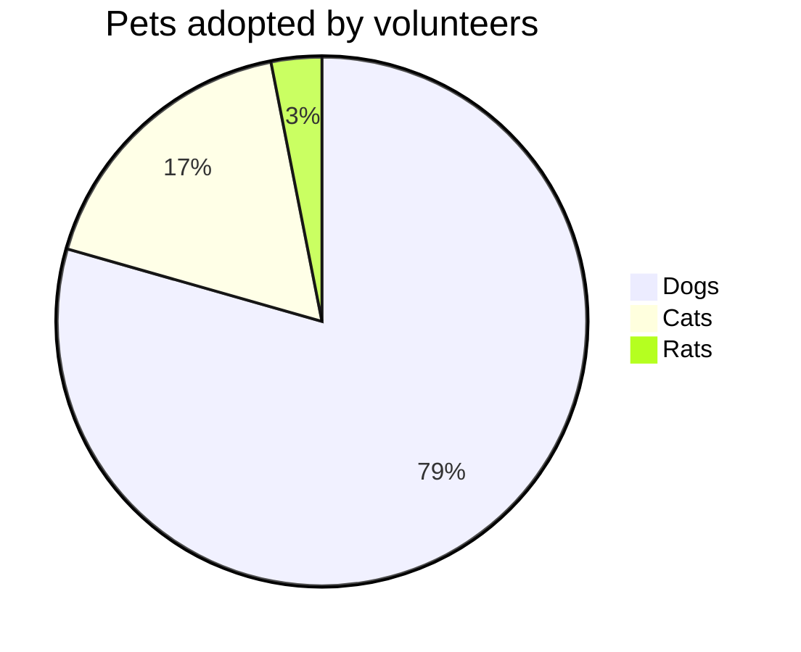
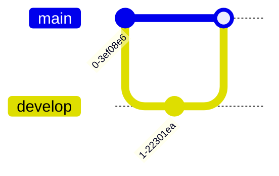
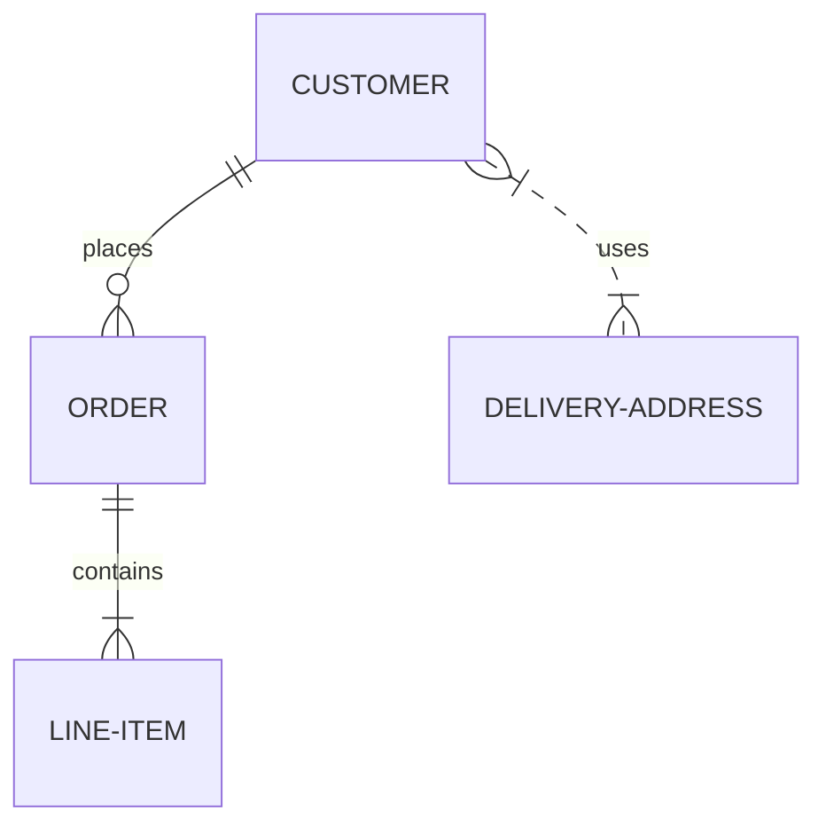
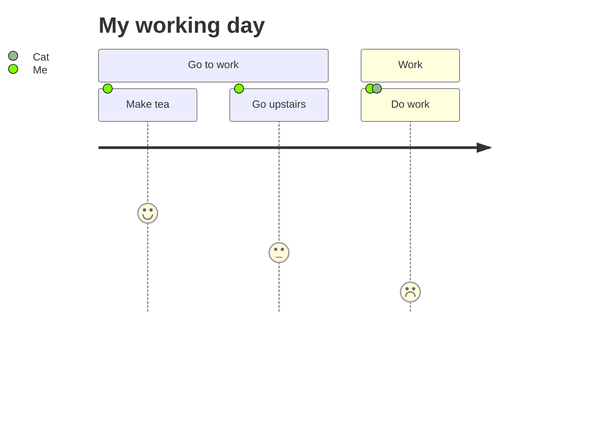

# @comark/mermaid

Mermaid diagram support for [comark](https://github.com/comarkdown/comark) using [Mermaid](https://mermaid.js.org/).

## Features

- ✅ Mermaid code blocks with ` ```mermaid ` syntax
- ✅ Automatic SVG rendering
- ✅ Full Mermaid diagram types support (flowcharts, sequence diagrams, Gantt charts, etc.)
- ✅ Vue and React components
- ✅ TypeScript support
- ✅ Error handling with visual feedback
- ✅ Customizable themes

## Installation

```bash
npm install @comark/mermaid comark mermaid
# or
pnpm add @comark/mermaid comark mermaid
# or
yarn add @comark/mermaid comark mermaid
```

**Note:** Mermaid is a peer dependency. Make sure to install it.

## Usage

### Vue

```vue
<script setup>
import { Comark } from 'comark/vue'
import mermaidPlugin from '@comark/mermaid'
import { Mermaid } from '@comark/mermaid/vue'

const markdown = `
# Diagram Example

\`\`\`mermaid
graph TD
    A[Start] --> B{Is it working?}
    B -->|Yes| C[Great!]
    B -->|No| D[Debug]
    D --> A
\`\`\`
`

const components = {
  mermaid: Mermaid
}
</script>

<template>
  <Suspense>
    <Comark :markdown="markdown" :components="components" :options="{ plugins: [mermaidPlugin()] }" />
  </Suspense>
</template>
```

**Important:**
- The `mermaidPlugin` must be passed to identify and parse mermaid code blocks
- Comark component requires `<Suspense>` wrapper (it's async)

### React

```tsx
import { Comark } from 'comark/react'
import mermaidPlugin from '@comark/mermaid'
import { Mermaid } from '@comark/mermaid/react'

const components = {
  mermaid: Mermaid
}

function App() {
  const markdown = `
# Diagram Example

\`\`\`mermaid
graph TD
    A[Start] --> B{Is it working?}
    B -->|Yes| C[Great!]
    B -->|No| D[Debug]
    D --> A
\`\`\`
  `

  return <Comark markdown={markdown} components={components} options={{ plugins: [mermaidPlugin()] }} />
}
```

**Important:**
- The `mermaidPlugin` must be passed to identify and parse mermaid code blocks

### Core Parsing API

```typescript
import { parse } from 'comark'
import mermaidPlugin from '@comark/mermaid'

const result = await parse(`
\`\`\`mermaid
graph LR
    A --> B
\`\`\`
`, {
  plugins: [mermaidPlugin()]
})

// The AST will contain mermaid nodes with diagram code
console.log(result.body)
```

## How It Works

The plugin uses a two-stage approach:

1. **Parse Time (markdown-it plugin):**
   - Identifies code blocks with `mermaid` language
   - Stores the diagram code in the AST
   - No rendering happens at this stage

2. **Render Time (Vue/React components):**
   - The `Mermaid` component receives diagram code via props
   - Mermaid renders the diagram to SVG on demand
   - Component displays error messages if rendering fails

This architecture provides optimal performance by separating parsing from rendering.

## Supported Diagram Types

Mermaid supports many diagram types:

### Flowcharts

````markdown

````

### Sequence Diagrams

````markdown

````

### Class Diagrams

````markdown

````

### State Diagrams

````markdown

````

### Gantt Charts

````markdown

````

### Pie Charts

````markdown

````

### Git Graphs

````markdown

````

### ER Diagrams

````markdown

````

### Journey Diagrams

````markdown

````

## Configuration

### Theme Support

You can configure the mermaid theme:

```typescript
import { createMermaidPlugin } from '@comark/mermaid'

const mermaidPlugin = createMermaidPlugin({
  theme: 'dark' // 'default' | 'dark' | 'forest' | 'neutral'
})
```

### Advanced Configuration

Pass custom mermaid options:

```typescript
const mermaidPlugin = createMermaidPlugin({
  theme: 'dark',
  options: {
    fontFamily: 'Arial',
    flowchart: {
      curve: 'basis'
    }
  }
})
```

### Mermaid Component Props

Both Vue and React `Mermaid` components accept:

- `content` (string, required): The Mermaid diagram code
- `class` (string, optional): CSS classes for styling

## Troubleshooting

### Diagrams not rendering

1. **Plugin not included**: Make sure to pass `plugins: [mermaidPlugin()]` to the parse/Comark component
2. **Component not registered**: Register the `Mermaid` component in the components map
3. **Syntax errors**: Check the Mermaid syntax - the component will display error messages

### Diagrams appearing as code blocks

If you see the raw mermaid code in a code block:
- The plugin might not be loaded
- Check that the plugin is in the `plugins` array
- Ensure the code block uses `mermaid` as the language

### Invalid syntax errors

The component will show a visual error message for invalid Mermaid syntax:
- Check your diagram syntax at [Mermaid Live Editor](https://mermaid.live)
- Review the [Mermaid documentation](https://mermaid.js.org/intro/)

### Performance issues

For pages with many diagrams:
- Consider lazy loading diagrams
- Use code splitting for the mermaid dependency
- Mermaid diagrams are rendered client-side and can be CPU-intensive

## Performance

The plugin is designed for performance:

1. **Parse-time identification**: Diagrams are identified during markdown parsing
2. **Lazy rendering**: Mermaid only renders when components mount
3. **No regex scanning at render time**: All pattern matching happens once during parse
4. **Minimal overhead**: Diagram code stored as plain text in AST until render

## Development

```bash
# Install dependencies
pnpm install

# Build
pnpm build

# Test
pnpm test

# Run tests in watch mode
pnpm test -- --watch
```

## Resources

- [Mermaid Documentation](https://mermaid.js.org/intro/)
- [Mermaid Live Editor](https://mermaid.live) - Test your diagrams
- [Mermaid Cheat Sheet](https://jojozhuang.github.io/tutorial/mermaid-cheat-sheet/)

## License

MIT
